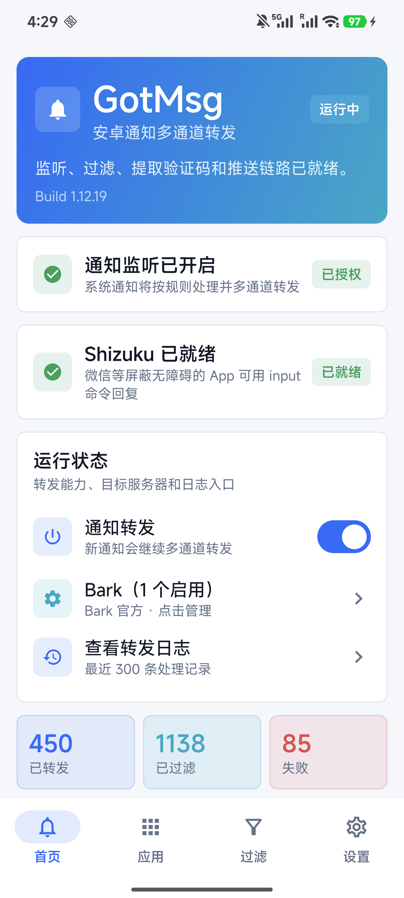
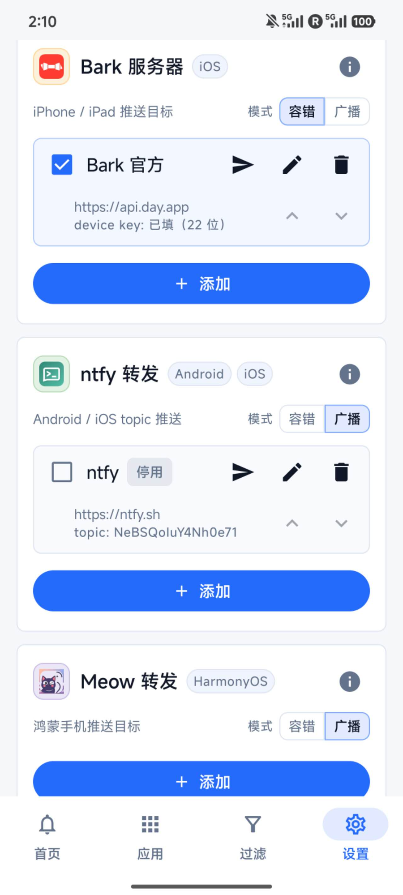
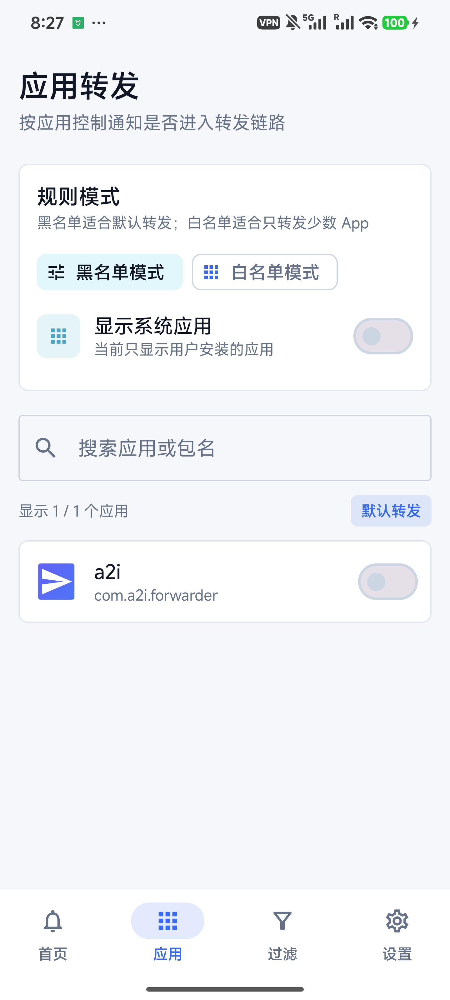
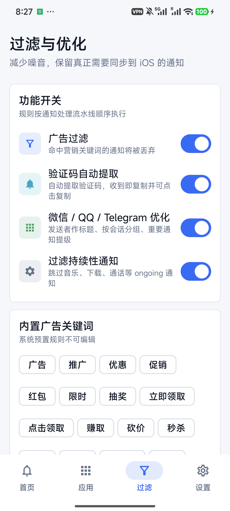
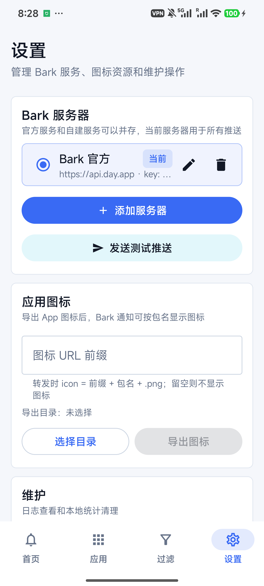
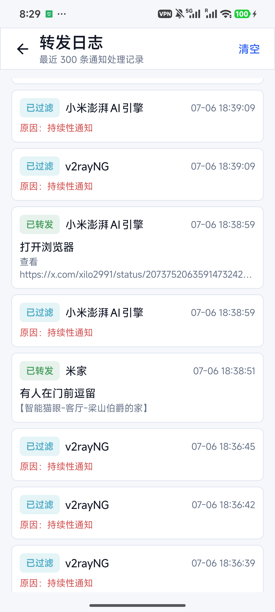
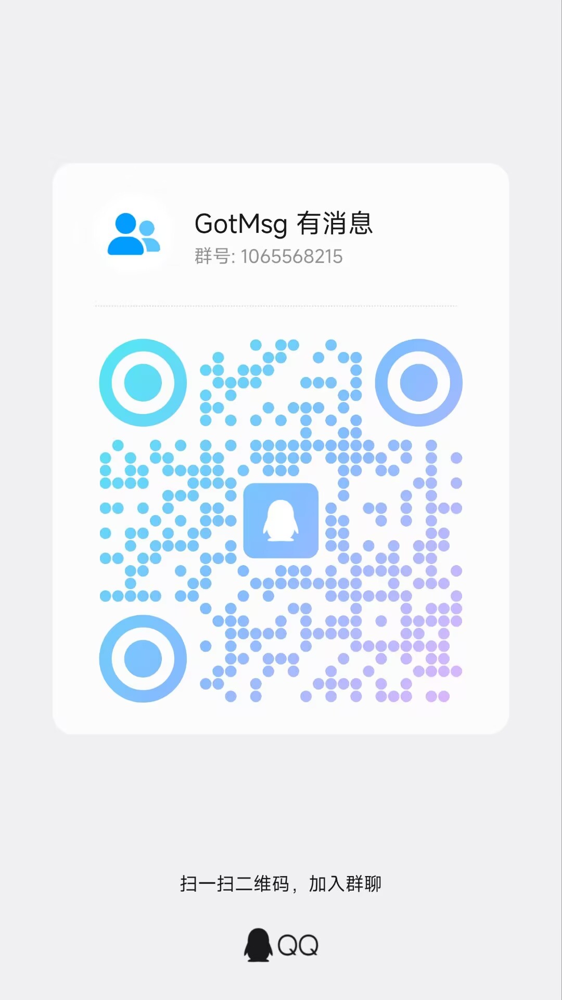

# GotMsg · 有消息

<p align="center">
  
</p>

<p align="center">
  
  
  
  
  
</p>

GotMsg 安装在一台 Android 手机上，读取这台手机收到的系统通知，再转发到 **iPhone、iPad、另一台 Android、鸿蒙手机或邮箱**。短信验证码、来电、微信、QQ、Telegram 和普通 App 通知都可以进入转发链路。

除了“看通知”，GotMsg 还支持从 Bark / ntfy 通知打开一次性网页，把回复送回原 Android 手机：优先使用系统快捷回复，QQ 等 App 可走无障碍兼容回复，微信可走 Shizuku。

> [!IMPORTANT]
> GotMsg 不是聊天软件，也不会登录微信或 QQ。它处理的是 Android 通知；原 App 没有产生通知、通知内容被隐藏，或原手机被系统彻底休眠时，GotMsg 就拿不到对应内容。

## 功能一览

| 功能 | 状态 | 说明 |
|---|---:|---|
| 多通道转发 | 🟢 | Bark、ntfy、Meow、SMTP 电邮，可同时启用多条配置 |
| 断网短信兜底 | 🟢 | 原手机断网时，用 SIM 卡短信转发验证码、来电等紧要通知 |
| 验证码提取 | 🟢 | 识别 4–8 位验证码，可自动复制并提升重要通知级别 |
| App 黑白名单 | 🟢 | 默认转发全部或只转发指定 App |
| 广告与噪音过滤 | 🟢 | 内置规则、自定义关键词、常驻通知过滤和 5 秒去重 |
| 来电与未接来电 | 🟢 | 兼容 MIUI / HyperOS；有权限时补充号码和联系人姓名 |
| 远程回复 | 🟢 | Android `RemoteInput`、无障碍兼容回复、微信 Shizuku 回复 |
| 锁屏 PIN 自动解锁 | 🟡 可选 | 仅 Shizuku 已运行时；PIN 用 Android Keystore 加密保存，每次最多尝试一次 |
| 自动更新 | 🟢 | Gitea 优先、GitHub 备用；自动选择当前手机适配的 APK |
| 日志与失败重试 | 🟢 | 最近 300 条处理记录；发送失败进入待重发队列 |

## 目录

- [先看懂两台手机的角色](#先看懂两台手机的角色)
- [需要安装哪些 App](#需要安装哪些-app)
- [十分钟上手](#十分钟上手)
- [推送通道详细配置](#推送通道详细配置)
- [远程回复详细教程](#远程回复详细教程)
- [权限和后台保活](#权限和后台保活)
- [过滤、来电、图标和更新](#过滤来电图标和更新)
- [常见问题排查](#常见问题排查)
- [界面截图](#界面截图)
- [隐私与安全](#隐私与安全)

---

## 先看懂两台手机的角色

| 名称 | 是哪台设备 | 要做什么 |
|---|---|---|
| **原手机 / 发送端** | 收到短信、微信、QQ 等通知的 Android 手机 | 安装 GotMsg，授予通知读取权限，保持联网和后台运行 |
| **接收端** | 你随身使用的 iPhone、iPad、Android、鸿蒙手机或电脑 | 根据通道安装 Bark、ntfy、Meow，或直接收邮件 / 短信 |

举例：一台放在家里的小米 Android 手机插着银行卡手机号，你日常使用 iPhone。GotMsg 安装在小米手机，Bark 安装在 iPhone。

> [!WARNING]
> 不要把 GotMsg 只安装在接收端。GotMsg 必须安装在“实际收到原始通知”的 Android 手机上。

## 需要安装哪些 App

### 原 Android 手机上

| App | 是否必须 | 用途 | 安装来源 |
|---|---:|---|---|
| **GotMsg** | 必须 | 读取、过滤和转发通知 | [本仓库 Releases](../../releases) |
| **Shizuku** | 仅微信回复 / PIN 自动解锁需要 | 以 ADB shell 权限操作微信输入、发送和锁屏 PIN | [Shizuku 官网](https://shizuku.rikka.app/download/) / [GitHub Releases](https://github.com/RikkaApps/Shizuku/releases) |

QQ、支付宝、淘宝和钉钉的兼容回复依赖 Android 系统自带的**无障碍服务**，不需要另外安装无障碍 App。

### 接收端

| 接收端 | 推荐方案 | 需要安装 |
|---|---|---|
| iPhone / iPad | **Bark** | [App Store](https://apps.apple.com/app/bark-custom-notifications/id1403753865) |
| Android | **ntfy** | [Google Play](https://play.google.com/store/apps/details?id=io.heckel.ntfy) / [F-Droid](https://f-droid.org/packages/io.heckel.ntfy/) / [GitHub](https://github.com/binwiederhier/ntfy/releases) |
| iPhone（也想用 ntfy） | ntfy | [App Store](https://apps.apple.com/us/app/ntfy/id1625396347) |
| 鸿蒙 / HarmonyOS | **Meow** | 从你使用的 Meow 项目或服务提供方安装；需要能取得推送接口和 Device Key / Token |
| 电脑、平板 | 电邮 | 不需要专用 App，使用现有邮件客户端即可 |
| 任意手机 | 断网短信兜底 | 不需要额外 App，使用系统短信应用接收 |

打开远程回复网页只需要普通浏览器，不需要 iOS 快捷指令，也不需要额外的 `_reply` topic。

---

## 十分钟上手

### 第 1 步：下载并安装 GotMsg

1. 在原 Android 手机上打开 [Releases](../../releases)。
2. 不知道手机架构时，下载文件名带 **`universal`** 的 APK，兼容性最好。
3. 大多数近年的 Android 手机是 ARM64，也可以下载 **`arm64-v8a`**，体积略小。
4. 浏览器提示“禁止安装未知应用”时，进入系统提示页，只允许当前浏览器或文件管理器完成这一次安装。
5. 安装完成后打开 GotMsg。

系统要求：**Android 14 / API 34 或更高版本**。低于 Android 14 无法安装。

### 第 2 步：先配置一个接收通道

第一次使用最推荐：

- iPhone / iPad：选 **Bark**。
- Android：选 **ntfy**。
- 鸿蒙：选 **Meow**。
- 只想在电脑查看：选 **电邮**。

进入 GotMsg 底部 **设置**，找到相应通道，先按下方教程添加配置，再点击该配置右侧的发送按钮测试。接收端收到“GotMsg 测试”才算配置成功。

### 第 3 步：授予通知读取权限

1. 回到 GotMsg **首页**。
2. 点击“需要授权通知监听”或“前往系统授权”。
3. 在系统“设备和应用通知 / 通知使用权 / 通知访问”页面找到 GotMsg。
4. 打开允许开关并确认风险提示。
5. 返回 GotMsg，首页应显示 **“通知监听已开启 / 已授权”**。

这项权限是核心权限；普通“允许 GotMsg 自己弹通知”不能代替通知读取权限。

### 第 4 步：开启转发并实测

1. 首页打开 **通知转发**。
2. 用另一台手机给原手机发一条短信或聊天消息。
3. 接收端应在几秒内收到对应通知。
4. 如果没有收到，先打开 GotMsg **首页 → 查看转发日志**，日志会说明是已发送、被过滤还是发送失败。

### 第 5 步：设置后台运行

完成基础测试后，务必按[权限和后台保活](#权限和后台保活)设置自启动、后台无限制和省电白名单，否则锁屏一段时间后可能停止转发。

---

## 推送通道详细配置

各通道都支持添加多条配置、单独启停和排序；Bark、ntfy、Meow 和电邮配置还可单独发送测试。“首个成功即止”适合相同通道的备用目标；关闭后会向该通道所有已启用配置广播。

### Bark：发送到 iPhone / iPad

1. 在 iPhone / iPad 安装 [Bark](https://apps.apple.com/app/bark-custom-notifications/id1403753865)。
2. 第一次打开 Bark 时允许通知。
3. Bark 首页会显示类似 `https://api.day.app/xxxxxxxx` 的推送地址，复制它。
4. 原 Android 手机打开 GotMsg → **设置 → Bark 服务器 → 添加**。
5. 按下面填写：

   | 字段 | 填写内容 |
   |---|---|
   | 名称 | 自定义，例如“我的 iPhone” |
   | 服务器地址 | 官方服务填 `https://api.day.app`，不要带最后的 Device Key |
   | Device Key | Bark 地址最后 `/` 后面的字符串 |

6. 保存后点击配置右侧的发送按钮。
7. iPhone 收到“GotMsg 测试”即成功。

远程回复启用后，点击 Bark 通知会进入 GotMsg 回复网页。为避免重复，回复地址不再同时显示在通知正文里。

### ntfy：发送到 Android / iOS / 网页

1. 在接收端安装 ntfy：Android 可用 [Google Play](https://play.google.com/store/apps/details?id=io.heckel.ntfy)、[F-Droid](https://f-droid.org/packages/io.heckel.ntfy/) 或 [GitHub Releases](https://github.com/binwiederhier/ntfy/releases)；iPhone 使用 [App Store](https://apps.apple.com/us/app/ntfy/id1625396347)。
2. 打开 ntfy，添加一个订阅。
3. 官方服务器填写 `https://ntfy.sh`。
4. Topic 使用一串不容易猜到的随机名称，例如 `gotmsg_7f3a9c2e`。
5. 原 Android 手机打开 GotMsg → **设置 → ntfy 转发 → 添加**。
6. 服务器和 Topic 必须与接收端完全一致；Token 只有在自建 ntfy 并开启鉴权时才填写。
7. 保存并发送测试。

> [!CAUTION]
> `ntfy.sh` 的公共 Topic 类似“知道名字就能进入的房间”。不要使用手机号、姓名、邮箱或 `test` 这类容易猜到的 Topic。需要更强隐私时请自建 ntfy 并启用访问控制。

远程回复启用后，ntfy 通知会带“回复”动作，点击通知也会进入回复页；正文不再重复附加相同链接。

### Meow：发送到鸿蒙手机

Meow 不是 GotMsg 内置组件，需要先在鸿蒙手机上安装并完成 Meow 自身的推送注册。不同 Meow 服务的分发方式和接口格式可能不同，请以你所使用的 Meow 项目说明为准。

1. 在鸿蒙手机打开 Meow，确认它能正常接收测试推送。
2. 在 Meow 中找到完整推送接口 / 服务器地址和 Device Key / Token。
3. GotMsg → **设置 → Meow 转发 → 添加**。
4. 名称用于区分设备；服务器填写 Meow 给出的地址；Device Key 填 Meow 的设备 Key。
5. 保存后发送测试。

不要在 Device Key 中填写鸿蒙锁屏密码、华为账号密码或短信验证码。

### SMTP 电邮

GotMsg 直接连接 SMTP 服务器发送邮件。QQ 邮箱、163、Gmail、Outlook 等通常需要先在邮箱安全设置里开启 SMTP，并生成**授权码 / 应用专用密码**，不建议直接填写网页登录密码。

| 字段 | 示例 |
|---|---|
| SMTP 主机 | `smtp.qq.com`、`smtp.163.com`、`smtp.gmail.com` |
| 端口 | 国内邮箱通常用 `465`（隐式 SSL） |
| 账号 | 完整邮箱地址 |
| 授权码 / 密码 | 邮箱后台生成的 SMTP 授权码 |
| 发件人 | 通常与账号一致 |
| 收件人 | 实际接收通知的邮箱 |

保存后务必发送测试。如果超时，先检查端口、授权码、运营商网络是否拦截 SMTP。

### 断网短信兜底

该功能在原 Android 手机**没有网络**时，用原手机 SIM 卡发送短信，因此会消耗短信套餐。

1. GotMsg → **设置 → 断网短信兜底**，授予“发送短信”权限。
2. 添加接收手机号并启用。
3. 默认“仅紧要通知”只发送验证码和来电；关闭后会尝试发送全部通知。
4. 建议保持限频，例如每 5 分钟最多 1 条。
5. 开启余额检查后，余额低于或等于 5 时自动挂起；也可以使用手动短信额度。

> [!WARNING]
> 短信兜底不是普通在线转发通道。手机有网络时，通知仍走 Bark、ntfy、Meow 或邮件。

---

## 远程回复详细教程

### 回复链路

1. 原手机收到通知并转发到 Bark / ntfy。
2. 接收端点击通知或“回复”动作，打开 `https://r.gotmsg.pp.ua`。
3. 页面显示原通知的应用、标题和正文，输入回复内容并提交。
4. 原手机上的 GotMsg 拉取任务并执行回复。
5. 页面显示成功或具体失败原因。

链接从通知转发起 **10 分钟内有效**，并且只允许成功提交一次。当前 Bark / ntfy 转发通知都会生成回复入口；如果原通知既没有系统快捷回复，也不属于兼容白名单，页面会明确返回不支持，而不会盲目操作原 App。

### 三种回复方式

| 方式 | 典型 App | 原手机额外要求 | 是否打开聊天页 |
|---|---|---|---:|
| Android `RemoteInput` | Telegram、WhatsApp、Signal、部分短信和企业 IM；以该条通知实际提供的动作为准 | 无 | 否 |
| 无障碍兼容回复 | QQ、支付宝、淘宝、钉钉 | 开启 GotMsg 兼容回复无障碍服务 | 是 |
| Shizuku 回复 | 微信 | 安装并启动 Shizuku，授权 GotMsg | 是 |

同一个 App 并非所有通知都支持快捷回复：聊天通知可能支持，登录、营销、付款、订单和系统通知通常不支持。

### QQ、支付宝、淘宝、钉钉：开启无障碍兼容回复

1. GotMsg → **设置 → 通知回复**。
2. 打开 **无障碍兼容回复**。
3. 系统跳到无障碍页面后，找到 **GotMsg 兼容回复**。
4. 阅读系统提示并启用服务。
5. 返回 GotMsg，确认开关仍开启。

执行时 GotMsg 会打开原通知对应的聊天页，拒绝覆盖已有草稿，只点击文字明确匹配“发送”的控件。回复结束后：有 Shizuku 时切回 GotMsg；无 Shizuku 时用无障碍返回桌面，避免 QQ 等聊天页停留前台后不再弹新通知。

### 微信：安装和启动 Shizuku

微信新版会屏蔽普通无障碍输入，因此微信回复必须使用 Shizuku。

1. 从 [Shizuku 官网](https://shizuku.rikka.app/download/) 或 [GitHub Releases](https://github.com/RikkaApps/Shizuku/releases) 安装 Shizuku。
2. Android 11 及以上推荐在 Shizuku 内按提示使用“无线调试”启动：
   - 系统设置 → 关于手机，连续点击版本号，打开开发者选项；
   - 开发者选项 → 无线调试；
   - 在 Shizuku 中选择配对，按页面提示输入系统配对码；
   - 配对完成后回到 Shizuku 点击启动。
3. 打开 GotMsg 首页，Shizuku 状态卡应显示 **“Shizuku 已就绪”**。
4. 如果显示“未授权”，点击 **授权 Shizuku**，并在 Shizuku 弹窗中允许 GotMsg。
5. GotMsg → **设置 → 通知回复**，打开“无障碍兼容回复”总开关。微信实际执行走 Shizuku；仅为了微信时可以不启用系统无障碍服务。

非 Root 方式启动的 Shizuku 在手机重启后通常需要重新启动。GotMsg 首页会直接显示当前状态。

### 可选：Shizuku PIN 自动解锁

适合原手机平时锁屏放置、希望收到远程回复后自动亮屏执行的场景。

1. 确认 Shizuku 已就绪。
2. GotMsg → **设置 → 通知回复**。
3. 输入原手机 4–16 位数字锁屏 PIN，点击“保存并启用”。
4. PIN 使用 Android Keystore AES-GCM 加密，仅保存在原手机，并排除云备份和设备迁移。
5. 每个回复任务最多提交一次 PIN；失败不会自动重试，避免触发系统锁定策略。

限制：手机重启后的第一次解锁仍必须手动完成；Shizuku 未运行时不能自动输入 PIN；图案、字母密码和生物识别不能代替这里的数字 PIN。

完整技术说明和错误含义见 [通知远程回复文档](docs/notification-reply.md)。

---

## 权限和后台保活

### 权限用途

| 权限 / 系统服务 | 是否必须 | 用途 |
|---|---:|---|
| 通知使用权 / 通知访问 | **必须** | 读取原手机上的系统通知 |
| 网络 | **必须** | 发送到各在线通道、检查更新和远程回复 |
| GotMsg 自身通知 | 建议 | 显示状态和更新提醒；不能代替通知使用权 |
| 电话 | 使用来电功能时 | 读取电话状态 |
| 通话记录 | 使用未接来电时 | 通话结束后查找未接号码 |
| 联系人 | 希望显示联系人姓名时 | 用号码反查本地联系人 |
| 发送短信 | 使用断网兜底时 | 从原手机 SIM 卡发送短信 |
| 无障碍 | 使用 QQ 等兼容回复时 | 找输入框、写入回复、点击发送和返回桌面 |
| Shizuku | 使用微信回复 / PIN 解锁时 | 以 ADB shell 权限执行输入、剪贴板、点击和锁屏操作 |
| 安装未知应用 | App 内更新时 | 下载完成后调起系统安装器 |

### 防止锁屏后停止转发

不同品牌名称不同，目标都是让 GotMsg 可以长期在后台运行：

1. 系统设置 → 应用 → GotMsg → 电池 / 耗电管理 → 选择**无限制 / 不优化**。
2. 在系统“自启动 / 后台启动 / 关联启动”里允许 GotMsg。
3. 最近任务界面如果支持“锁定应用”，锁定 GotMsg。
4. 不要使用一键清理、深度省电或第三方管家强制结束 GotMsg。
5. 修改权限或系统升级后，回到首页确认“通知监听已开启”。

小米 / HyperOS 常见路径：设置 → 应用设置 → 应用管理 → GotMsg → 省电策略 → 无限制，并允许自启动。三星常见路径：设置 → 电池 → 后台使用限制 → 从深度休眠应用中移除。

---

## 过滤、来电、图标和更新

### 应用黑白名单

- **黑名单模式**：默认转发所有 App，只排除你不想转发的 App；适合大多数人。
- **白名单模式**：默认不转发，只允许勾选的 App；适合只收短信验证码或少数聊天 App。

### 过滤与验证码

“过滤”页可控制持续通知、验证码提取、广告过滤和特殊 App 优化。内置规则会过滤 VPN / 代理常驻通知、系统“正在运行”、近空内容和泛化“你有一条新消息”等噪音；用户可继续添加自定义广告关键词。

每条通知在 5 秒窗口内去重。微信、QQ、Telegram 会进行专门解析；验证码可自动复制，重要通知会提高推送级别。

### 来电和未接来电

MIUI / HyperOS 经常不把系统电话通知交给第三方监听器。GotMsg 会额外轮询电话状态：

- 来电时推送“有电话进来”；无障碍若能读取来电界面，可补充号码。
- 通话结束后读取通话记录，识别未接号码；有联系人权限时显示姓名。

### 应用图标

在 **设置 → 应用图标** 填写公网图标 URL 前缀，并把已安装 App 图标导出到选定目录。上传后，GotMsg 按 `URL 前缀 + 包名 + .png` 生成通知图标地址。留空则不附加自定义图标。

### 应用内更新

- 启动约 5 秒后检查一次，之后每 24 小时巡检。
- 同时查询 Gitea 和 GitHub；同版本优先 Gitea，取两边可用的最高版本。
- 升级弹窗只显示当前目标版本和本次发版说明，不再展示一长串 ABI 安装包。
- App 自动选择当前手机 ABI，对应包不存在时使用 universal。
- 安装前 Android 会要求允许 GotMsg“安装未知应用”。

---

## 常见问题排查

| 现象 / 报错 | 处理方法 |
|---|---|
| 完全没有转发 | 首页确认“通知监听已开启”和“通知转发”已打开；再检查至少一个通道配置已启用 |
| 测试推送成功，锁屏后不再转发 | 设置电池无限制、自启动和最近任务锁定；检查系统是否撤销通知使用权 |
| 日志显示“已过滤” | 点开该条日志查看原因；检查黑白名单、广告关键词、持续通知和特殊 App 规则 |
| Bark 收不到 | 检查服务器地址不要带 Device Key；Device Key 不要漏字符；暂时关闭 VPN / 代理测试 |
| ntfy 收不到 | 接收端与 GotMsg 的服务器和 Topic 必须完全一致；确认 ntfy App 允许通知和后台运行 |
| Meow 收不到 | 先确认 Meow 自身能收测试；检查完整接口地址和 Device Key / Token |
| 邮件发送失败 | 使用 SMTP 授权码而不是网页登录密码；检查 465/SSL、发件人和网络限制 |
| 回复链接已过期 | 链接有效期 10 分钟；等待一条新通知再回复 |
| 原通知已消失 | 不要划掉原手机通知；等待新通知重新生成会话 |
| 微信提示 Shizuku 未就绪 | 打开 Shizuku 重新启动服务并授权 GotMsg；重启手机后通常需要重新启动 Shizuku |
| 微信未进入聊天页 | 确认通知点击本身能打开对应聊天，而不是联系人页、登录页或广告页 |
| QQ 找不到输入框 / 发送按钮 | 确认系统无障碍服务已开启；QQ 界面升级后可能需要重新适配，请保留 `A2iReply` 日志 |
| 原手机设置了 PIN | 配置 Shizuku PIN 自动解锁，或先手动解锁再回复；首次开机解锁不能自动完成 |
| 输入框已有草稿 | GotMsg 为避免覆盖原内容会主动停止；先在原手机处理草稿 |
| 下载后不能安装更新 | 系统设置 → 特殊应用权限 → 安装未知应用 → 允许 GotMsg |

日志页保存最近 300 条处理记录。发送失败会进入“待重发”，联网后由系统后台任务继续尝试。

---

## 界面截图

原 README 首图 `overview.png` 已移动到本节，作为多通道设置界面展示。

| 多通道设置 | 应用管理 | 过滤设置 |
|---|---|---|
|  |  |  |

| 设置 | 转发日志 |
|---|---|
|  |  |

---

## QQ 交流群

配置、转发或远程回复遇到问题，可扫码加入 QQ 群。反馈回复问题时，建议同时提供 GotMsg 版本、手机型号、Android 版本、目标 App 版本和日志中的完整报错。

<p align="center">
  
</p>

---

## 隐私与安全

### 通知内容会经过哪里

- Bark、ntfy、Meow、SMTP 或短信服务需要接收你选择转发的通知内容；使用公共服务前请阅读对应服务的隐私政策。
- 开启远程回复后，GotMsg 会把应用名、通知标题和正文注册到 `https://r.gotmsg.pp.ua`，用于回复页预览；回复正文也会经过该中继。
- 回复链接包含一次性能力令牌。令牌放在 URL fragment 中，首次网页请求不会把它写入服务器访问日志；不要把有效回复链接转发给别人。
- 中继保存设备鉴权哈希、通知预览、会话状态和短期回复任务；等待中的会话过期后清理，已处理状态和回复最多保留约 24 小时用于结果查询与排错。

### 技术统计

当前版本会向项目自有的 `https://stats.gotmsg.pp.ua/v1/events` 发送安装、启动和各通道成功 / 失败等技术统计，包括随机安装 ID、Android ID、会话 ID、App 版本、Android 版本、厂商型号、语言地区、时区、网络类型、通道、状态和精简失败原因。统计事件不包含通知标题、通知正文、回复正文、Bark Key、ntfy Token、邮箱授权码或锁屏 PIN。

### 本地敏感数据

- Bark Key、ntfy Token、SMTP 配置等保存在 Android 应用私有存储中，请保护原手机锁屏和系统账号。
- Shizuku 自动解锁 PIN 使用 Android Keystore AES-GCM 加密，且排除云备份与设备迁移；关闭功能后可在设置中删除 PIN。
- 无障碍和 Shizuku 权限能力较高，只应在你信任、由你控制的原 Android 手机上启用。

---

<details>
<summary><strong>高级用户：自建 Bark / ntfy</strong></summary>

### Bark Server

```bash
docker run -d --name bark --restart=unless-stopped \
  -p 8080:8080 \
  -v /var/lib/bark:/data \
  finab/bark-server
```

用 Nginx / Caddy 配置 HTTPS 后，GotMsg 的服务器地址填写站点根地址，不要追加 `/push`。详情见 [Bark 文档](https://bark.day.app/#/) 和 [Bark GitHub](https://github.com/Finb/Bark)。

### ntfy Server

```bash
docker run -d --name ntfy --restart=unless-stopped \
  -p 80:80 \
  -v /var/lib/ntfy:/var/lib/ntfy \
  binwiederhier/ntfy serve
```

生产使用建议配置 HTTPS、缓存文件和访问控制。详情见 [ntfy 安装文档](https://docs.ntfy.sh/install/)。

</details>

## 发布与许可

- 最新安装包：[Releases](../../releases)
- Android 最低版本：Android 14 / API 34
- 自 v1.10.2 起项目闭源，公开仓库保留用户文档、截图和 Release 安装包。
- 本项目仅供个人使用，**All Rights Reserved / 保留所有权利**。
