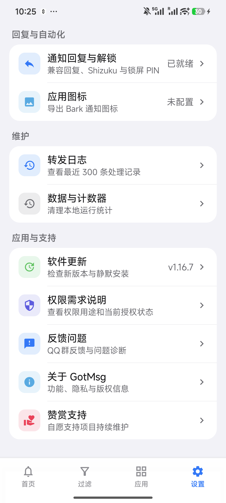
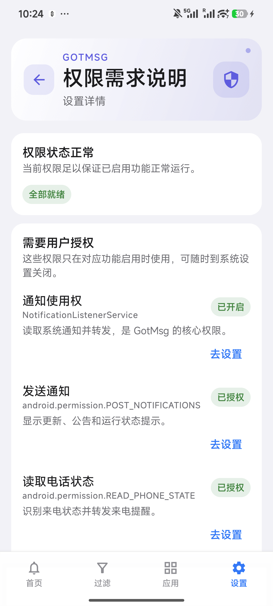
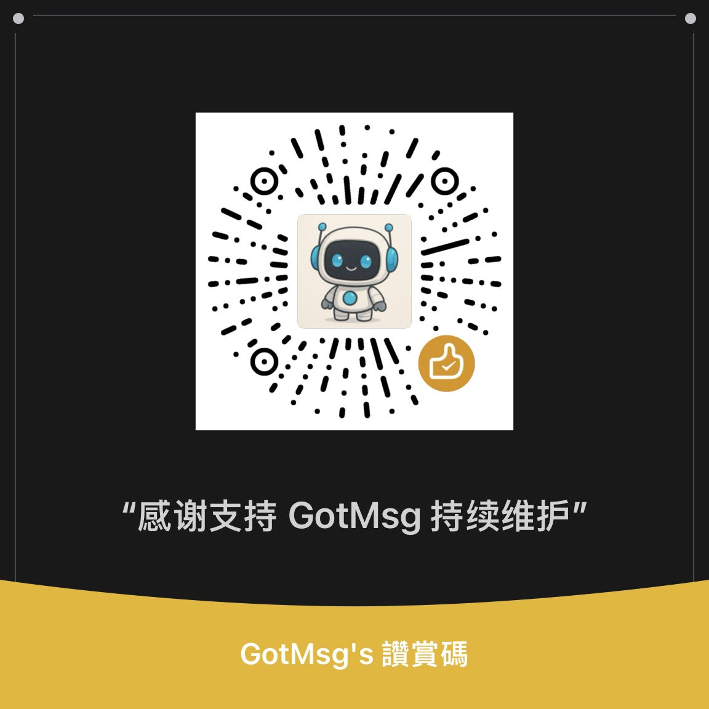

# GotMsg · 有消息

<p align="center">
  
</p>

<p align="center">
  
  
  
  
  
</p>

GotMsg 安装在一台 Android 手机上，读取这台手机收到的系统通知，再转发到 **iPhone、iPad、另一台 Android、鸿蒙手机、邮箱或指定用户的私聊机器人**。短信验证码、来电、微信、QQ、Telegram 和普通 App 通知都可以进入转发链路。

除了“看通知”，GotMsg 还支持从 Bark / ntfy 通知打开一次性网页，把回复送回原 Android 手机：优先使用系统快捷回复，QQ 等 App 可走无障碍兼容回复，微信可走 Shizuku。

> [!IMPORTANT]
> GotMsg 不是聊天软件，也不会登录微信或 QQ。它处理的是 Android 通知；原 App 没有产生通知、通知内容被隐藏，或原手机被系统彻底休眠时，GotMsg 就拿不到对应内容。

## 功能一览

| 功能 | 状态 | 说明 |
|---|---:|---|
| 多通道转发 | 🟢 | Bark、ntfy、Meow、SMTP 电邮、Telegram 私聊、飞书企业应用私聊、钉钉企业机器人私聊，可同时启用多条配置 |
| 断网短信兜底 | 🟢 | 原手机断网时，用 SIM 卡短信转发验证码、来电等紧要通知 |
| 验证码提取 | 🟢 | 识别 4–8 位验证码；锁屏通知被星号遮挡时可用 Shizuku 恢复原文，否则安全过滤 |
| App 黑白名单 | 🟢 | 默认转发全部或只转发指定 App；规则加载失败时自动暂停转发 |
| 广告与噪音过滤 | 🟢 | 内置规则、自定义关键词、常驻通知过滤和 5 秒去重 |
| 来电与未接来电 | 🟢 | 兼容 MIUI / HyperOS；有权限时补充号码和联系人姓名 |
| 远程回复 | 🟢 | Android `RemoteInput`、无障碍兼容回复、微信 Shizuku 回复 |
| 锁屏 PIN 自动解锁 | 🟡 可选 | 仅 Shizuku 已运行时；PIN 用 Android Keystore 加密保存，每次最多尝试一次 |
| 自动更新 | 🟢 | 默认开启 Shizuku 静默更新；Gitea 优先、GitHub 备用，自动选择本机适配 APK |
| 权限健康检查 | 🟢 | 启动时按已启用功能检查必要权限，异常时从首页直达权限说明和系统设置 |
| 日志与失败重试 | 🟢 | 最近 300 条处理记录；发送失败进入待重发队列 |

## 目录

- [先看懂两台手机的角色](#先看懂两台手机的角色)
- [先选择适合自己的接收方式](#先选择适合自己的接收方式)
- [需要安装哪些 App](#需要安装哪些-app)
- [十分钟上手](#十分钟上手)
- [推送通道详细配置](#推送通道详细配置)
- [远程回复详细教程](#远程回复详细教程)
- [权限和后台保活](#权限和后台保活)
- [过滤、来电、图标和更新](#过滤来电图标和更新)
- [常见问题排查](#常见问题排查)
- [界面截图](#界面截图)
- [赞赏支持](#赞赏支持)
- [隐私与安全](#隐私与安全)

---

## 先看懂两台手机的角色

| 名称 | 是哪台设备 | 要做什么 |
|---|---|---|
| **原手机 / 发送端** | 收到短信、微信、QQ 等通知的 Android 手机 | 安装 GotMsg，授予通知读取权限，保持联网和后台运行 |
| **接收端** | 你随身使用的 iPhone、iPad、Android、鸿蒙手机或电脑 | 根据通道安装 Bark、ntfy、Meow、Telegram、飞书或钉钉，或直接收邮件 / 短信 |

举例：一台放在家里的小米 Android 手机插着银行卡手机号，你日常使用 iPhone。GotMsg 安装在小米手机，Bark 安装在 iPhone。

> [!WARNING]
> 不要把 GotMsg 只安装在接收端。GotMsg 必须安装在“实际收到原始通知”的 Android 手机上。

### 文档里的按钮和设备怎么认

- 写成 **设置 → Bark → 添加**，表示先打开 GotMsg，点底部“设置”，再依次点“Bark”和“添加”。
- 写成“原手机”，始终指安装 GotMsg、实际收到短信或聊天通知的 Android 手机。
- 写成“接收端”，指最终查看转发通知的 iPhone、Android、鸿蒙手机、平板或电脑。
- 文档中的 Token、Key、Secret、授权码都属于密码。可以粘贴到 GotMsg 对应输入框，不要发到群里、截图分享或填进不明网页。

## 先选择适合自己的接收方式

第一次使用只配置一个通道，测试成功后再添加其它通道。不要一开始把所有通道都打开，否则失败时很难判断是哪一项填错。

| 你的接收设备 / 账号 | 建议通道 | 难度 | 开始前需要准备 |
|---|---|---:|---|
| iPhone / iPad | **Bark** | 最简单 | 接收端安装 Bark |
| 另一台 Android | **ntfy** | 简单 | 接收端安装 ntfy，并创建一个随机 Topic |
| 鸿蒙手机 | **Meow** | 取决于服务方 | 已能正常使用的 Meow 客户端、接口地址和 Device Key |
| 普通邮箱 | **SMTP 电邮** | 中等 | 邮箱已开启 SMTP，并取得授权码 / 应用专用密码 |
| Telegram | **Telegram 私聊机器人** | 中等 | Telegram 账号、Bot Token 和私人 Chat ID |
| 飞书企业成员 | **飞书企业应用机器人** | 较难 | 企业自建应用权限；通常需要企业管理员或开发者权限 |
| 钉钉企业成员 | **钉钉企业内部机器人** | 较难 | 企业内部应用权限；通常需要企业管理员或开发者权限 |
| 原手机可能长期断网 | **短信兜底** | 中等 | 原手机插有可发送短信的 SIM 卡和短信套餐 |

> [!TIP]
> 只想尽快用起来：iPhone 选 Bark，Android 选 ntfy。飞书和钉钉不是“复制一个群机器人 Webhook”就能使用，它们需要企业内部应用；没有企业管理权限时应选其它通道。

## 需要安装哪些 App

### 原 Android 手机上

| App | 是否必须 | 用途 | 安装来源 |
|---|---:|---|---|
| **GotMsg** | 必须 | 读取、过滤和转发通知 | [本仓库 Releases](../../releases) |
| **Shizuku** | 微信回复、PIN 自动解锁、自动静默更新需要；锁屏仍隐藏验证码时可选 | 以 ADB shell 权限操作微信、锁屏、静默安装新版，并在短信通知被系统脱敏时读取对应短信原文 | [Shizuku 官网](https://shizuku.rikka.app/download/) / [GitHub Releases](https://github.com/RikkaApps/Shizuku/releases) |

QQ、支付宝、淘宝和钉钉的兼容回复依赖 Android 系统自带的**无障碍服务**，不需要另外安装无障碍 App。

### 接收端

| 接收端 | 推荐方案 | 需要安装 |
|---|---|---|
| iPhone / iPad | **Bark** | [App Store](https://apps.apple.com/app/bark-custom-notifications/id1403753865) |
| Android | **ntfy** | [Google Play](https://play.google.com/store/apps/details?id=io.heckel.ntfy) / [F-Droid](https://f-droid.org/packages/io.heckel.ntfy/) / [GitHub](https://github.com/binwiederhier/ntfy/releases) |
| iPhone（也想用 ntfy） | ntfy | [App Store](https://apps.apple.com/us/app/ntfy/id1625396347) |
| Telegram 用户 | Telegram 私聊机器人 | Telegram 客户端；机器人必须先由该用户打开并发送 `/start` |
| 飞书企业成员 | 飞书企业自建应用机器人 | 飞书客户端；应用需对该成员可见并取得发消息权限 |
| 钉钉企业成员 | 钉钉企业内部应用机器人 | 钉钉客户端；应用需启用人与机器人单聊能力 |
| 鸿蒙 / HarmonyOS | **Meow** | 从你使用的 Meow 项目或服务提供方安装；需要能取得推送接口和 Device Key / Token |
| 电脑、平板 | 电邮 | 不需要专用 App，使用现有邮件客户端即可 |
| 任意手机 | 断网短信兜底 | 不需要额外 App，使用系统短信应用接收 |

打开远程回复网页只需要普通浏览器，不需要 iOS 快捷指令，也不需要额外的 `_reply` topic。

---

## 十分钟上手

### 第 1 步：下载并安装 GotMsg

1. 在原 Android 手机上打开 [Releases](../../releases)。
2. 不知道手机架构时，下载文件名带 **`universal`** 的 APK，兼容性最好。
3. 大多数近年的 Android 手机是 ARM64，也可以下载 **`arm64-v8a`**，体积略小。
4. 浏览器提示“禁止安装未知应用”时，进入系统提示页，只允许当前浏览器或文件管理器完成这一次安装。
5. 安装完成后打开 GotMsg。

<details>
<summary><strong>手机提示“有风险”“不允许安装”怎么办</strong></summary>

1. 确认 APK 来自本仓库 Releases，不要安装聊天群里来源不明的改包。
2. 点系统提示中的“设置”，允许当前浏览器或文件管理器“安装未知应用”。
3. 返回上一页重新点 APK 安装。
4. 安装完成后可以把刚才的“允许安装未知应用”重新关闭。
5. 如果系统提示“与现有应用签名不一致”，不要卸载覆盖。先确认安装包来源和当前 GotMsg 是否为官方版本；卸载会清除全部配置。

</details>

系统要求：**Android 14 / API 34 或更高版本**。低于 Android 14 无法安装。

### 第 2 步：先配置一个接收通道

第一次使用最推荐：

- iPhone / iPad：选 **Bark**。
- Android：选 **ntfy**。
- 鸿蒙：选 **Meow**。
- 只想在电脑查看：选 **电邮**。

进入 GotMsg 底部 **设置**，找到相应通道，先按下方教程添加配置，再点击该配置右侧的发送按钮测试。接收端收到“GotMsg 测试”才算配置成功。

配置页每一行右侧常用按钮含义：开关用于启停该目标；纸飞机 / 发送按钮用于测试；铅笔用于修改；垃圾桶用于删除；上下箭头用于调整顺序。“首个成功即止”只影响同一通道内的多条配置，第一次使用保持默认即可。

### 第 3 步：授予通知读取权限

1. 回到 GotMsg **首页**。
2. 点击“需要授权通知监听”或“前往系统授权”。
3. 在系统“设备和应用通知 / 通知使用权 / 通知访问”页面找到 GotMsg。
4. 打开允许开关并确认风险提示。
5. 返回 GotMsg，首页应显示 **“通知监听已开启 / 已授权”**。

这项权限是核心权限；普通“允许 GotMsg 自己弹通知”不能代替通知读取权限。

如果首页仍显示待授权，点 **设置 → 权限需求说明**，下拉找到“通知使用权”，点击“去设置”再次确认。部分系统需要关闭后重新开启一次通知使用权，返回 GotMsg 后等待几秒刷新状态。

### 第 4 步：开启转发并实测

1. 首页打开 **通知转发**。
2. 用另一台手机给原手机发一条短信或聊天消息。
3. 接收端应在几秒内收到对应通知。
4. 如果没有收到，先打开 GotMsg **首页 → 查看转发日志**，日志会说明是已发送、被过滤还是发送失败。

### 第一次配置完成的判定标准

下面 5 项全部满足，才算基础配置完成：

- 接收通道的“GotMsg 测试”已收到。
- 首页显示通知监听已经授权。
- 首页“通知转发”开关已经打开。
- 用另一台设备制造真实短信或聊天通知后，接收端能收到转发。
- 锁屏原手机再测试一次，仍能收到转发。

测试时不要一直打开原聊天窗口。很多 App 在聊天页前台时不会产生系统通知，GotMsg 没有通知可读，自然不会转发。

### 第 5 步：设置后台运行

完成基础测试后，务必按[权限和后台保活](#权限和后台保活)设置自启动、后台无限制和省电白名单，否则锁屏一段时间后可能停止转发。

---

## 推送通道详细配置

各通道都支持添加多条配置、单独启停、排序和单条测试。“首个成功即止”适合相同通道的备用目标；关闭后会向该通道所有已启用配置广播。不同通道之间彼此独立并行发送，只要任一已配置通道成功，整条通知就记为发送成功；没有配置 Bark 不会产生 Bark 失败记录。

### Bark：发送到 iPhone / iPad

**适合谁：** 原手机是 Android，接收端是 iPhone 或 iPad。这是 iPhone 用户最容易配置的方案。

1. 在接收端安装 [Bark](https://apps.apple.com/app/bark-custom-notifications/id1403753865)。
2. 第一次打开 Bark 时点“允许通知”。如果不允许，推送虽然到达 Bark，iPhone 通知栏也不会提醒。
3. Bark 首页会显示类似 `https://api.day.app/xxxxxxxx` 的地址，点地址旁的复制按钮。
4. 回到原 Android 手机，打开 GotMsg → **设置 → Bark → 添加**。
5. 把刚才的地址拆成“服务器地址”和“Device Key”：

   | 字段 | 填写内容 |
   |---|---|
   | 名称 | 自定义，例如“我的 iPhone” |
   | 服务器地址 | 官方服务填 `https://api.day.app`，不要带最后的 Device Key |
   | Device Key | Bark 地址最后 `/` 后面的字符串 |

   例如 Bark 地址是 `https://api.day.app/AbCd1234`，服务器地址填 `https://api.day.app`，Device Key 填 `AbCd1234`。

6. 点“保存”，再点这条配置右侧的发送按钮。
7. iPhone 收到“GotMsg 测试”后，再回到 GotMsg 首页打开“通知转发”，制造一条真实通知测试。

远程回复启用后，点击 Bark 通知会进入 GotMsg 回复网页。为避免重复，回复地址不再同时显示在通知正文里。

<details>
<summary><strong>Bark 测试收不到时逐项检查</strong></summary>

1. 打开 iPhone → 设置 → 通知 → Bark，确认“允许通知”已开启。
2. 检查 GotMsg 中的服务器地址只有 `https://api.day.app`，末尾不要填 `/push`，也不要重复 Device Key。
3. 检查 Device Key 前后没有空格、中文引号或漏字符。
4. 在 Bark App 内点自己的推送地址做 Bark 自带测试。自带测试也收不到时，先解决 Bark 或网络问题。
5. 暂时关闭原手机和 iPhone 上的 VPN、代理、私人 DNS后再试。
6. 打开 GotMsg → 设置 → 转发日志，查看 Bark 返回的具体错误。

</details>

### ntfy：发送到 Android / iOS / 网页

**适合谁：** 接收端是另一台 Android；也支持 iPhone、iPad和网页浏览器。

1. 在接收端安装 ntfy：Android 可用 [Google Play](https://play.google.com/store/apps/details?id=io.heckel.ntfy)、[F-Droid](https://f-droid.org/packages/io.heckel.ntfy/) 或 [GitHub Releases](https://github.com/binwiederhier/ntfy/releases)；iPhone 使用 [App Store](https://apps.apple.com/us/app/ntfy/id1625396347)。
2. 第一次打开 ntfy 时允许通知，并允许它在后台运行。
3. 点“订阅 / Subscribe”或 `+`，服务器使用官方地址 `https://ntfy.sh`。
4. 自己创建一个不容易猜到的 Topic，例如 `gotmsg_7f3a9c2e`。Topic 相当于接收频道名称，不是账号，也不是手机号码。
5. 确认 ntfy 的订阅列表已经显示这个 Topic。
6. 回到原手机，打开 GotMsg → **设置 → ntfy → 添加**。
7. 按下面填写并保存：

   | 字段 | 填写内容 |
   |---|---|
   | 名称 | 自定义，例如“随身 Android” |
   | 服务器 | 与接收端完全相同，官方服务填 `https://ntfy.sh` |
   | Topic | 与接收端逐字相同，区分大小写 |
   | Token | 使用官方公共 Topic 时留空；只有自建 ntfy 开启鉴权后才填写 |

8. 点该配置右侧的发送按钮，接收端收到“GotMsg 测试”即成功。

> [!CAUTION]
> `ntfy.sh` 的公共 Topic 类似“知道名字就能进入的房间”。不要使用手机号、姓名、邮箱或 `test` 这类容易猜到的 Topic。需要更强隐私时请自建 ntfy 并启用访问控制。

远程回复启用后，ntfy 通知会带“回复”动作，点击通知也会进入回复页；正文不再重复附加相同链接。

<details>
<summary><strong>ntfy 测试收不到时逐项检查</strong></summary>

1. 对照两台手机，服务器和 Topic 必须完全一致，不能一台填 `ntfy.sh`、另一台填自建服务器。
2. Topic 不要带空格、斜杠或中文标点。
3. 打开接收端 ntfy，确认订阅没有暂停，系统通知权限和后台权限已开启。
4. 使用公共 `ntfy.sh` 时不要随便填写 Token；错误 Token 会导致鉴权失败。
5. 可在接收端浏览器打开 `https://ntfy.sh/你的Topic` 检查网页订阅。公共 Topic 的内容可能被知道名称的人看到。
6. 打开 GotMsg 转发日志查看 HTTP 状态或网络错误。

</details>

### Telegram：机器人私聊

**适合谁：** 希望在自己的 Telegram 私聊中接收通知。GotMsg 不支持群组、频道或群机器人。

1. 在接收端 Telegram 搜索并打开官方账号 `@BotFather`，核对账号带有认证标记。
2. 发送 `/newbot`。
3. 按提示输入机器人显示名称，例如 `我的 GotMsg`。
4. 再输入机器人用户名。用户名必须以 `bot` 结尾，例如 `my_gotmsg_notice_bot`。
5. BotFather 会返回一串 Bot Token，样式类似 `123456789:AA...`。长按复制并妥善保存。
6. 点 BotFather 消息中的机器人链接，打开你刚创建的机器人，点击“开始 / Start”或发送 `/start`。这一步不能省略，因为机器人不能主动发起首次私聊。
7. 按下面的折叠教程取得自己的私人 Chat ID。
8. 原手机打开 GotMsg → **设置 → Telegram → 添加**，填写名称、Bot Token 和私人 Chat ID。
9. 保存并发送测试。自己的 Telegram 私聊收到“GotMsg 测试”即成功。

<details>
<summary><strong>只用手机取得 Telegram 私人 Chat ID</strong></summary>

1. 确认你已经向新机器人发送过 `/start`。
2. 在手机浏览器打开无痕 / 隐私标签页。
3. 在地址栏输入下面的地址，把 `你的BotToken` 整段替换为 BotFather 给出的 Token，不要保留中文或尖括号：

   `https://api.telegram.org/bot你的BotToken/getUpdates`

4. 页面会显示一段 JSON 文本。搜索或仔细查找类似下面的内容：

   `"chat":{"id":123456789,"first_name":"你的名字","type":"private"}`

5. `id` 后面的正整数就是私人 Chat ID。只复制数字，不要复制逗号或引号。
6. 如果页面显示 `"result":[]`，回到 Telegram 再给机器人发一句普通文字，然后刷新网页。
7. 取得 ID 后关闭无痕标签页。Bot Token 出现在地址中，不要截图或把完整地址发给别人。

</details>

GotMsg 会拒绝负数群组 / 频道 Chat ID，也不提供群组 Topic。Bot Token 等同机器人控制凭据，不要发给他人。[Telegram Bot API](https://core.telegram.org/bots/api)

<details>
<summary><strong>Telegram 测试失败时逐项检查</strong></summary>

1. Chat ID 必须是正整数；以 `-` 开头的是群组或频道，GotMsg 会主动拒绝。
2. 确认使用的是新机器人对应的 Token，前后没有空格。
3. 确认接收用户已经打开机器人并发送 `/start`，且没有屏蔽机器人。
4. 若 BotFather 重新生成过 Token，旧 Token 会立即失效，需要在 GotMsg 中编辑更新。
5. 原手机网络需要能访问 `api.telegram.org`；所在网络无法访问 Telegram 时无法发送。

</details>

### 飞书：企业应用机器人私聊

**先确认账号条件：** 这不是飞书群里的“自定义机器人 Webhook”。你需要在自己所属企业创建“企业自建应用”，通常需要企业管理员或开发者权限。普通个人账号没有企业应用权限时无法完成，应改用 Bark、ntfy、Telegram 或电邮。

<details>
<summary><strong>飞书企业自建应用完整配置流程</strong></summary>

1. 在手机或电脑浏览器打开[飞书开放平台](https://open.feishu.cn/)，登录接收通知所用的飞书企业账号。手机页面显示不完整时，在浏览器菜单中打开“桌面版网站”。
2. 进入“开发者后台”，选择“创建企业自建应用”。不要选择商店应用，也不要创建群自定义机器人。
3. 填写应用名称、描述和图标，例如名称填 `GotMsg 通知`，创建应用。
4. 打开应用左侧的 **应用能力 / 添加应用能力**，找到“机器人”并添加。
5. 打开 **权限管理**，搜索并开通“以应用身份发消息”，权限标识通常显示为 `im:message:send_as_bot`。GotMsg 只需要机器人主动向指定成员发文本，不需要配置群 Webhook。
6. 打开 **应用发布 → 版本管理与发布**，创建版本，填写版本号和说明。
7. 在“可用范围”中加入要接收通知的飞书成员。目标成员不在可用范围内时，即使 App ID 和 Secret 正确也无法收到。
8. 提交发布。如果企业要求管理员审核，需要等待管理员通过后再测试。
9. 打开 **凭证与基础信息**，复制 App ID 和 App Secret。App Secret 只会填入 GotMsg，不要发送给其他人。
10. 准备接收者标识。小白最推荐使用目标成员绑定在同一飞书企业中的工作邮箱：在 GotMsg 中把“ID 类型”选为 `email`，接收者 ID 填完整邮箱地址。没有可用企业邮箱时，请让企业管理员提供该成员的 `open_id`、`user_id` 或 `union_id`，并在 GotMsg 中选择完全对应的类型。
11. 原手机打开 GotMsg → **设置 → 飞书机器人 → 添加**，填写：

    | GotMsg 字段 | 填写内容 |
    |---|---|
    | 名称 | 自定义，例如“我的飞书” |
    | App ID | 飞书“凭证与基础信息”中的 App ID |
    | App Secret | 同页的 App Secret |
    | ID 类型 | 推荐 `email`；否则与管理员提供的 ID 类型一致 |
    | 接收者 ID | 目标成员邮箱或对应用户 ID，只填一个人 |

12. 保存并点发送测试。目标成员与机器人私聊中收到“GotMsg 测试”即成功。

</details>

这里只调用企业应用消息接口，不接受 `chat_id`，也不支持飞书群机器人 Webhook。[飞书消息 API](https://open.feishu.cn/document/server-docs/im-v1/introduction)

<details>
<summary><strong>飞书测试失败时逐项检查</strong></summary>

1. 确认创建的是“企业自建应用”，且已经添加机器人能力，不是群自定义机器人。
2. 确认“以应用身份发消息”权限已经生效；仅在后台勾选但未发布 / 未审核时仍可能无效。
3. 确认目标成员属于同一企业，并在应用“可用范围”内。
4. ID 类型必须与内容一致：选 `email` 就填完整企业邮箱，选 `open_id` 就填 `ou_...`，不能混用。
5. App Secret 重新生成后，GotMsg 中保存的旧 Secret 会失效，需要编辑更新。
6. 打开 GotMsg 转发日志查看飞书返回的错误。鉴权失败通常检查 App ID / Secret；用户不可见通常检查可用范围和接收者 ID。

</details>

### 钉钉：企业内部机器人私聊

**先确认账号条件：** 这不是钉钉群里的“自定义机器人”。你需要创建企业内部应用，并取得应用和成员信息，通常需要组织管理员或开发者权限。个人钉钉账号没有企业应用权限时无法完成。

<details>
<summary><strong>钉钉企业内部机器人完整配置流程</strong></summary>

1. 在手机或电脑浏览器打开[钉钉开放平台](https://open.dingtalk.com/)，使用接收通知所在企业的管理员 / 开发者账号登录。手机页面不完整时启用浏览器“桌面版网站”。
2. 进入应用开发后台，选择创建“企业内部应用”。不要复制群聊中的自定义机器人 Webhook。
3. 填写应用名称、描述和图标，例如名称填 `GotMsg 通知`。
4. 在应用能力中添加“机器人”能力，启用“人与机器人单聊”场景。
5. 在权限管理中搜索并申请“企业内机器人发送消息”相关权限。
6. 在应用版本 / 发布管理中创建并发布一个版本，把接收通知的成员加入应用可见或可用范围。企业要求审核时需等待管理员通过。
7. 打开应用的凭证页面，复制 **Client ID / AppKey** 和 **Client Secret / AppSecret**。
8. 取得接收成员的 **User ID / 员工 UserID**。它不是手机号、昵称或钉钉号。最稳妥的方法是让企业管理员在组织通讯录 / 成员详情中查看并提供；后台名称变化时可搜索“员工 UserID”。
9. 原手机打开 GotMsg → **设置 → 钉钉机器人 → 添加**，填写：

    | GotMsg 字段 | 填写内容 |
    |---|---|
    | 名称 | 自定义，例如“我的钉钉” |
    | Client ID / AppKey | 企业内部应用凭证页中的 AppKey |
    | Client Secret / AppSecret | 同一应用的 AppSecret |
    | 接收者 User ID | 目标成员的员工 UserID，只填一个人 |

10. 保存并点发送测试。目标成员与企业内部机器人的单聊收到“GotMsg 测试”即成功。

</details>

这里只调用企业内部应用机器人的单聊接口 `/v1.0/robot/oToMessages/batchSend`，不支持钉钉群自定义机器人 Webhook。[钉钉开放平台](https://open.dingtalk.com/)

<details>
<summary><strong>钉钉测试失败时逐项检查</strong></summary>

1. 确认创建的是企业内部应用机器人，而不是群设置中复制出来的 Webhook 机器人。
2. 确认机器人能力、人与机器人单聊场景和发送消息权限都已开启并随版本发布生效。
3. 确认接收成员在应用可用范围内。
4. 接收者必须填员工 UserID，不能填手机号、昵称、企业名称或群号。
5. AppKey 与 AppSecret 必须来自同一个应用；重新生成 Secret 后需要同步修改 GotMsg。
6. 打开转发日志查看错误。鉴权失败先检查 AppKey / Secret，成员无效先检查 UserID 和应用范围。

</details>

### Meow：发送到鸿蒙手机

Meow 不是 GotMsg 内置组件，需要先在鸿蒙手机上安装并完成 Meow 自身的推送注册。不同 Meow 服务的分发方式和接口格式可能不同，请以你所使用的 Meow 项目说明为准。

1. 按 Meow 项目或服务提供方的说明，在鸿蒙手机安装并注册 Meow。
2. 先使用 Meow 自带测试确认鸿蒙端能够收到消息。自带测试未成功前不要配置 GotMsg。
3. 在 Meow 中找到“推送地址 / API 地址 / 服务器地址”和“Device Key / Token”。不同版本叫法可能不同。
4. 原手机打开 GotMsg → **设置 → Meow → 添加**。
5. 名称填“我的鸿蒙”等容易识别的文字；服务器填写服务方给出的完整接口地址；Device Key 填对应设备的 Key / Token。
6. 保存后点发送测试，鸿蒙端收到“GotMsg 测试”即成功。

不要在 Device Key 中填写鸿蒙锁屏密码、华为账号密码或短信验证码。

<details>
<summary><strong>Meow 测试失败时怎么判断</strong></summary>

- Meow 自带测试也失败：问题在 Meow 注册、鸿蒙通知权限或服务方，先按 Meow 文档解决。
- Meow 自带测试成功、GotMsg 失败：重点检查是否把“完整 API 地址”误填成官网首页，以及 Device Key 是否属于当前设备。
- 服务地址要求额外参数、签名或特殊 JSON 格式时，当前 GotMsg 通用 Meow 配置可能不兼容，需要向 Meow 服务方确认接口格式。

</details>

### SMTP 电邮

GotMsg 直接连接 SMTP 服务器发送纯文本邮件。当前只支持 **SMTPS / 隐式 TLS**，通常使用端口 `465`；只提供 `587` / STARTTLS 的邮箱目前不能直接使用。邮箱需要先开启 SMTP，并生成**授权码 / 应用专用密码**，不要直接填写网页登录密码。

| 字段 | 示例 |
|---|---|
| SMTP 主机 | `smtp.qq.com`、`smtp.163.com`、`smtp.gmail.com` |
| 端口 | 填 `465`（隐式 SSL / TLS） |
| 账号 | 完整邮箱地址 |
| 授权码 / 密码 | 邮箱后台生成的 SMTP 授权码 |
| 发件人 | 通常与账号一致 |
| 收件人 | 实际接收通知的邮箱 |

完整步骤：

1. 登录用于发件的邮箱网页版或官方 App，进入账号安全设置。
2. 开启 SMTP 服务。QQ / 163 通常会生成单独的 SMTP 授权码；Gmail 通常需要先开启两步验证，再创建应用专用密码。
3. 原手机打开 GotMsg → **设置 → 电邮**，先打开“启用电邮转发”。
4. 点“添加”，按上表填写。发件人通常必须与账号完全相同。
5. 保存后点发送测试，到收件箱和垃圾邮件中查找“GotMsg 测试”。
6. 测试成功后保留该配置的启用开关。

<details>
<summary><strong>常见邮箱填写示例</strong></summary>

| 邮箱 | SMTP 主机 | 端口 | 密码栏填写 |
|---|---|---:|---|
| QQ 邮箱 | `smtp.qq.com` | `465` | QQ 邮箱设置中生成的 SMTP 授权码 |
| 163 邮箱 | `smtp.163.com` | `465` | 163 邮箱设置中生成的客户端授权密码 |
| Gmail | `smtp.gmail.com` | `465` | Google 账号两步验证下生成的应用专用密码 |

Outlook / Microsoft 365 常用 `587` + STARTTLS，当前 GotMsg 的 SMTP 发送器不支持这一连接方式，不要直接照搬 `587` 配置。

</details>

<details>
<summary><strong>邮件测试失败时逐项检查</strong></summary>

1. 确认使用授权码 / 应用专用密码，不是网页登录密码。
2. 确认端口是 `465`，服务器支持隐式 TLS。
3. 确认账号和发件人都是完整邮箱地址，且通常应保持一致。
4. 查看垃圾邮件；部分邮箱会把第一次自动通知归类为垃圾邮件。
5. “连接超时”通常是主机、端口、网络或运营商拦截；“AUTH”通常是账号或授权码错误；“FROM / TO”通常是发件人或收件人格式错误。
6. 企业邮箱还可能限制第三方 SMTP 登录，需要联系邮箱管理员。

</details>

### 断网短信兜底

该功能在原 Android 手机**没有网络**时，用原手机 SIM 卡发送短信，因此会消耗短信套餐。

1. GotMsg → **设置 → 断网短信兜底**，授予“发送短信”权限。
2. 添加接收手机号并启用。
3. 默认“仅紧要通知”只发送验证码和来电；关闭后会尝试发送全部通知。
4. 建议保持限频，例如每 5 分钟最多 1 条。
5. 开启余额检查后，余额低于或等于 5 时自动挂起；也可以使用手动短信额度。

> [!WARNING]
> 短信兜底不是普通在线转发通道。手机有网络时，通知仍走已启用的网络推送、私聊机器人或邮件通道。

---

## 远程回复详细教程

远程回复入口会自动附加到支持回复的 Bark / ntfy 转发通知中，**没有单独的“开启远程回复”总开关**。Telegram、飞书、钉钉、Meow、电邮和短信只接收转发内容，不会生成 GotMsg 回复入口。

第一次测试远程回复，建议先用 Telegram、WhatsApp、Signal 或其它通知本身带“回复”按钮的 App：

1. 确认 Bark 或 ntfy 基础转发已经成功。
2. 让另一位用户给原手机发一条聊天消息，保持原聊天 App 在后台，让系统产生通知。
3. 在接收端点 Bark 通知，或点 ntfy 通知中的“回复”。
4. 浏览器打开回复页后输入一句无关紧要的测试文字并提交。
5. 查看原手机聊天是否发出，并等待网页显示成功或明确错误。

原手机必须联网，GotMsg 必须仍有通知使用权并能在后台运行。划掉原手机上的原通知、强制停止 GotMsg、超过有效期或原 App 撤销回复入口后都可能无法执行。

### 回复链路

1. 原手机收到通知并转发到 Bark / ntfy。
2. 接收端点击通知或“回复”动作，打开 `https://r.gotmsg.pp.ua`。
3. 页面显示原通知的应用、标题和正文，输入回复内容并提交。
4. 原手机上的 GotMsg 拉取任务并执行回复。
5. 页面显示成功或具体失败原因。

链接从通知转发起 **10 分钟内有效**，并且只允许成功提交一次。Bark / ntfy 转发通知通常会生成回复入口；**短信 App 中识别出的验证码通知不添加回复链接**，因为验证码只需要读取或复制，不需要回复。如果其它通知既没有系统快捷回复，也不属于兼容白名单，页面会明确返回不支持，而不会盲目操作原 App。

### 三种回复方式

| 方式 | 典型 App | 原手机额外要求 | 是否打开聊天页 |
|---|---|---|---:|
| Android `RemoteInput` | Telegram、WhatsApp、Signal、部分短信和企业 IM；以该条通知实际提供的动作为准 | 无 | 否 |
| 无障碍兼容回复 | QQ、支付宝、淘宝、钉钉 | 开启 GotMsg 兼容回复无障碍服务 | 是 |
| Shizuku 回复 | 微信 | 安装并启动 Shizuku，授权 GotMsg | 是 |

同一个 App 并非所有通知都支持快捷回复：聊天通知可能支持，登录、营销、付款、订单和系统通知通常不支持。

### QQ、支付宝、淘宝、钉钉：开启无障碍兼容回复

只有通知本身没有 Android 快捷回复时才会使用这条兼容路径。它会实际打开原手机上的聊天页，因此原手机可能亮屏或切换前台应用。

1. GotMsg → **设置 → 通知回复与解锁**。
2. 打开 **无障碍兼容回复**。
3. 系统跳到无障碍页面后，找到 **GotMsg 兼容回复**。
4. 阅读系统提示并启用服务。
5. 返回 GotMsg，确认开关仍开启。

执行时 GotMsg 会打开原通知对应的聊天页，拒绝覆盖已有草稿，只点击文字明确匹配“发送”的控件。回复结束后：有 Shizuku 时切回 GotMsg；无 Shizuku 时用无障碍返回桌面，避免 QQ 等聊天页停留前台后不再弹新通知。

### 锁屏验证码显示为 `******`：优先调整系统设置

如果原手机锁屏时，短信通知只显示 `******`，可以先让系统在锁屏通知中显示完整内容。设置成功后，GotMsg 能直接从通知读取并转发真实验证码，**仅为了验证码时不需要安装 Shizuku**。

不同品牌的菜单名称会有差异，通常按下面顺序检查：

1. 系统设置 → **通知与状态栏 / 通知中心** → **锁屏通知**。
2. 选择 **显示通知和内容 / 显示所有通知内容**，关闭“隐藏敏感内容”。
3. 系统设置 → 应用 → 应用管理 → 你正在使用的**短信 App** → 通知管理。
4. 打开短信 App 的锁屏通知，并确认其锁屏显示方式也是“显示内容”。
5. 锁定手机后重新接收一条验证码短信测试；必须确认锁屏通知正文已经显示真实数字，而不是 `******`。

> [!WARNING]
> 开启后，拿到或看到原手机的人也可能直接在锁屏界面看到短信和验证码。原手机经常放在公共场所、包含银行验证码或对隐私要求较高时，建议继续隐藏锁屏内容，并使用 Shizuku 恢复；不要为了方便降低不符合自己使用场景的隐私保护。

### 微信：安装和启动 Shizuku

微信新版会屏蔽普通无障碍输入，因此微信回复必须使用 Shizuku。

<details>
<summary><strong>第一次安装、配对和授权 Shizuku</strong></summary>

1. 从 [Shizuku 官网](https://shizuku.rikka.app/download/) 或 [GitHub Releases](https://github.com/RikkaApps/Shizuku/releases) 安装 Shizuku。
2. 打开系统设置 → 关于手机，连续点击“版本号 / 系统版本”约 7 次，直到提示已经进入开发者模式。
3. 返回系统设置，搜索并打开“开发者选项”，再打开“无线调试”。原手机需要连接 Wi-Fi；这里不要求连接电脑。
4. 打开 Shizuku，选择“通过无线调试启动”→“配对”。
5. 按 Shizuku 页面提示打开系统“使用配对码配对设备”，把系统显示的 6 位配对码输入 Shizuku 通知或配对框。
6. 配对成功后回到 Shizuku，点击“启动”。首页应显示 Shizuku 正在运行。
3. 打开 GotMsg 首页，Shizuku 状态卡应显示 **“Shizuku 已就绪”**。
4. 如果显示“未授权”，点击 **授权 Shizuku**，并在 Shizuku 弹窗中允许 GotMsg。
5. GotMsg → **设置 → 通知回复与解锁**，打开“无障碍兼容回复”总开关。微信实际执行走 Shizuku；仅为了微信时可以不启用系统无障碍服务。

</details>

非 Root 方式启动的 Shizuku 在手机重启后通常需要重新启动。GotMsg 首页会直接显示当前状态。

Shizuku 也用于恢复锁屏时被系统短信 App 显示成 `******` 的验证码。GotMsg 只在检测到脱敏验证码通知时，按通知时间查找收件箱中对应的最近短信；确认能提取出真实 4–8 位验证码才转发。Shizuku 未就绪或无法确认对应短信时，该通知会直接过滤，不会把星号内容发到接收端。

### 可选：Shizuku PIN 自动解锁

适合原手机平时锁屏放置、希望收到远程回复后自动亮屏执行的场景。

<details>
<summary><strong>配置锁屏 PIN 自动解锁</strong></summary>

1. 确认 Shizuku 已就绪。
2. GotMsg → **设置 → 通知回复与解锁**。
3. 输入原手机 4–16 位数字锁屏 PIN，点击“保存并启用”。
4. PIN 使用 Android Keystore AES-GCM 加密，仅保存在原手机，并排除云备份和设备迁移。
5. 每个回复任务最多提交一次 PIN；失败不会自动重试，避免触发系统锁定策略。

限制：手机重启后的第一次解锁仍必须手动完成；Shizuku 未运行时不能自动输入 PIN；图案、字母密码和生物识别不能代替这里的数字 PIN。

</details>

<details>
<summary><strong>回复页常见提示是什么意思</strong></summary>

| 页面提示 | 原因和处理 |
|---|---|
| 回复会话已过期 | 超过 10 分钟，等待一条新通知重新打开回复页 |
| 原通知已消失 | 原手机通知被划掉或 App 更新了通知，等待新消息 |
| 原手机需解锁 | 原通知要求身份验证；手动解锁，或配置 Shizuku PIN |
| 没有可用的快捷回复 | 原通知不带回复动作；支持的 App 可再启用兼容回复 |
| 无障碍兼容回复未启用 | 到“设置 → 通知回复与解锁”打开开关并授权系统无障碍 |
| Shizuku 未就绪 / 未授权 | 打开 Shizuku 启动服务，再回 GotMsg 授权 |
| 输入框已有草稿 | GotMsg 为避免覆盖文字主动停止，先在原手机处理草稿 |

</details>

完整技术说明和错误含义见 [通知远程回复文档](docs/notification-reply.md)。

---

## 权限和后台保活

### 权限用途

| 权限 / 系统服务 | 是否必须 | 用途 |
|---|---:|---|
| 通知使用权 / 通知访问 | **必须** | 读取原手机上的系统通知 |
| 网络 | **必须** | 发送到各在线通道、检查更新和远程回复 |
| GotMsg 自身通知 | 建议 | 显示状态和更新提醒；不能代替通知使用权 |
| 电话 | 使用来电功能时 | 读取电话状态 |
| 通话记录 | 使用未接来电时 | 通话结束后查找未接号码 |
| 联系人 | 希望显示联系人姓名时 | 用号码反查本地联系人 |
| 发送短信 | 使用断网兜底时 | 从原手机 SIM 卡发送短信 |
| 无障碍 | 使用 QQ 等兼容回复时 | 找输入框、写入回复、点击发送和返回桌面 |
| Shizuku | 使用微信回复、PIN 解锁、锁屏验证码恢复或自动静默更新时 | 以 ADB shell 权限执行输入、剪贴板、锁屏、静默安装，以及按通知时间读取对应短信原文 |
| 安装未知应用 | App 内更新时 | 下载完成后调起系统安装器 |

### 防止锁屏后停止转发

不同品牌名称不同，目标都是让 GotMsg 可以长期在后台运行：

1. 系统设置 → 应用 → GotMsg → 电池 / 耗电管理 → 选择**无限制 / 不优化**。
2. 在系统“自启动 / 后台启动 / 关联启动”里允许 GotMsg。
3. 最近任务界面如果支持“锁定应用”，锁定 GotMsg。
4. 不要使用一键清理、深度省电或第三方管家强制结束 GotMsg。
5. 修改权限或系统升级后，回到首页确认“通知监听已开启”。

小米 / HyperOS 常见路径：设置 → 应用设置 → 应用管理 → GotMsg → 省电策略 → 无限制，并允许自启动。三星常见路径：设置 → 电池 → 后台使用限制 → 从深度休眠应用中移除。

---

## 过滤、来电、图标和更新

### 应用黑白名单

- **黑名单模式**：默认转发所有 App，只排除你不想转发的 App；适合大多数人。
- **白名单模式**：默认不转发，只允许勾选的 App；适合只收短信验证码或少数聊天 App。
- GotMsg 启动时会先加载已保存规则；加载完成前或读取失败时按应用转发保持暂停，避免白名单配置短暂失效。
- VPN、代理和设备互联等高频通知来源默认位于黑名单中，需要时可以在应用页手动开启，不再使用无法覆盖的包名强制过滤。

### 过滤与验证码

“过滤”页可控制持续通知、验证码提取、广告过滤和特殊 App 优化。内置规则会过滤 VPN / 代理常驻通知、系统“正在运行”、近空内容和泛化“你有一条新消息”等噪音；用户可继续添加自定义广告关键词。

每条通知在 5 秒窗口内去重。微信、QQ、Telegram 会进行专门解析；验证码可自动复制，重要通知会提高推送级别。

### 来电和未接来电

MIUI / HyperOS 经常不把系统电话通知交给第三方监听器。GotMsg 会额外轮询电话状态：

- 来电时推送“有电话进来”；无障碍若能读取来电界面，可补充号码。
- 通话结束后读取通话记录，识别未接号码；有联系人权限时显示姓名。

### 应用图标

在 **设置 → 应用图标** 填写公网图标 URL 前缀，并把已安装 App 图标导出到选定目录。上传后，GotMsg 按 `URL 前缀 + 包名 + .png` 生成通知图标地址。留空则不附加自定义图标。

### 应用内更新

- **设置 → 更新 → 自动静默更新**默认开启。开启时每 3 小时检查一次；发现新版后自动选择本机 ABI，下载并通过已授权的 Shizuku 静默安装，安装完成后重新启动 GotMsg。
- 关闭“自动静默更新”后，每 6 小时检查一次；只显示更新提示，由用户在原有更新弹窗中选择安装包并手动安装。
- 两种模式都在 App 启动约 5 秒后检查，并使用 WorkManager 做后台周期兜底。Android 的省电和后台调度策略可能让实际执行时间略晚于 3 / 6 小时。
- 同时查询 Gitea 和 GitHub；同版本优先 Gitea，取两边可用的最高版本。
- 静默更新只在 Shizuku 正在运行且 GotMsg 已获授权时执行；Shizuku 不可用会安全退回普通更新提示，不会误报安装成功。两个发布源版本一致时才跨源下载兜底，APK 最终仍由 Android 校验应用签名。
- 升级弹窗只显示当前目标版本的发版说明，同时列出可用 ABI 安装包；系统会把本机适配版本排在第一位、标注“本机推荐”并默认选中，也可手动改选通用版或其它架构。
- App 自动选择当前手机 ABI，对应包不存在时使用 universal。
- 手动安装前 Android 会要求允许 GotMsg“安装未知应用”；Shizuku 静默安装不弹系统安装确认框。

### GotMsg 官方公告

- GotMsg 每次回到前台时和后台定期访问项目自有的 `https://stats.gotmsg.pp.ua/v1/announcements/feed`，读取仍在有效期内且匹配当前 App 版本的官方公告。
- 公告会在原手机显示本地系统通知；打开 GotMsg 的全局转发开关后，还会直接转发到所有已启用网络通道。不经过通知监听器回收，因此不会形成自身通知循环，也不会生成回复链接。
- 本地通知和四类外部渠道分别记录发送状态：同一公告在同一渠道成功发送后不会因定时检查而重复推送；某一渠道发送失败只重试该渠道，不会重复发送已经成功的其它渠道。
- 首次使用需要允许 GotMsg 发送通知。未授权时不会把公告误记为已读，授权后会立即重新检查。
- 公告撤回只能阻止尚未获取的手机继续接收，无法远程删除已经显示在手机通知栏中的内容。

---

## 常见问题排查

| 现象 / 报错 | 处理方法 |
|---|---|
| 完全没有转发 | 首页确认“通知监听已开启”和“通知转发”已打开；再检查至少一个通道配置已启用 |
| 测试推送成功，锁屏后不再转发 | 设置电池无限制、自启动和最近任务锁定；检查系统是否撤销通知使用权 |
| 日志显示“已过滤” | 点开该条日志查看原因；检查黑白名单、广告关键词、持续通知和特殊 App 规则 |
| Bark 收不到 | 检查服务器地址不要带 Device Key；Device Key 不要漏字符；暂时关闭 VPN / 代理测试 |
| ntfy 收不到 | 接收端与 GotMsg 的服务器和 Topic 必须完全一致；确认 ntfy App 允许通知和后台运行 |
| Meow 收不到 | 先确认 Meow 自身能收测试；检查完整接口地址和 Device Key / Token |
| 邮件发送失败 | 使用 SMTP 授权码而不是网页登录密码；检查 465/SSL、发件人和网络限制 |
| 锁屏后收到的验证码变成 `******` | 优先把系统和短信 App 的锁屏通知改为“显示内容”；如果希望继续隐藏锁屏内容，再启动并授权 Shizuku。Shizuku 未安装、未运行或未授权时，GotMsg 不会转发星号正文，而会向所有已启用网络通道发送“验证码无法读取”提醒，请回到安装 GotMsg 的原手机查看 |
| 回复链接已过期 | 链接有效期 10 分钟；等待一条新通知再回复 |
| 原通知已消失 | 不要划掉原手机通知；等待新通知重新生成会话 |
| 微信提示 Shizuku 未就绪 | 打开 Shizuku 重新启动服务并授权 GotMsg；重启手机后通常需要重新启动 Shizuku |
| 微信未进入聊天页 | 确认通知点击本身能打开对应聊天，而不是联系人页、登录页或广告页 |
| QQ 找不到输入框 / 发送按钮 | 确认系统无障碍服务已开启；QQ 界面升级后可能需要重新适配，请保留 `A2iReply` 日志 |
| 原手机设置了 PIN | 配置 Shizuku PIN 自动解锁，或先手动解锁再回复；首次开机解锁不能自动完成 |
| 输入框已有草稿 | GotMsg 为避免覆盖原内容会主动停止；先在原手机处理草稿 |
| 下载后不能安装更新 | 系统设置 → 特殊应用权限 → 安装未知应用 → 允许 GotMsg |

日志页保存最近 300 条处理记录。发送失败会进入“待重发”，联网后由系统后台任务继续尝试。

---

## 界面截图

原 README 首图 `overview.png` 已移动到本节，作为多通道设置界面展示。

| 多通道设置 | 应用管理 | 过滤设置 |
|---|---|---|
|  |  |  |

| 设置总览 | 应用与支持 | 权限说明 |
|---|---|---|
|  |  |  |

| 转发日志 |
|---|
|  |

---

## QQ 交流群

配置、转发或远程回复遇到问题，可扫码加入 QQ 群。反馈回复问题时，建议同时提供 GotMsg 版本、手机型号、Android 版本、目标 App 版本和日志中的完整报错。

<p align="center">
  
</p>

---

## 赞赏支持

如果 GotMsg 帮你节省了盯通知、找验证码或跨设备回复的时间，欢迎通过微信赞赏支持持续维护。

赞赏完全自愿，不影响任何功能使用。

<p align="center">
  
</p>

---

## 隐私与安全

### 通知内容会经过哪里

- Bark、ntfy、Meow、Telegram、飞书、钉钉、SMTP 或短信服务需要接收你选择转发的通知内容；使用第三方服务前请阅读对应服务的隐私政策。
- 开启远程回复后，GotMsg 会把应用名、通知标题和正文注册到 `https://r.gotmsg.pp.ua`，用于回复页预览；回复正文也会经过该中继。
- 回复链接包含一次性能力令牌。令牌放在 URL fragment 中，首次网页请求不会把它写入服务器访问日志；不要把有效回复链接转发给别人。
- 中继保存设备鉴权哈希、通知预览、会话状态和短期回复任务；等待中的会话过期后清理，已处理状态和回复最多保留约 24 小时用于结果查询与排错。

### 技术统计

当前版本会向项目自有的 `https://stats.gotmsg.pp.ua/v1/events` 发送安装、启动和各通道成功 / 失败等技术统计，包括随机安装 ID、Android ID、会话 ID、App 版本、Android 版本、厂商型号、语言地区、时区、网络类型、通道、状态和精简失败原因。统计事件不包含通知标题、通知正文、回复正文、Bark Key、ntfy Token、邮箱授权码或锁屏 PIN。

GotMsg 会从 `https://stats.gotmsg.pp.ua/v1/announcements/feed` 获取官方公告。请求只携带固定 App ID 和当前版本号，不上传通知内容、推送密钥或手机联系人等个人数据。

### 本地敏感数据

- Bark Key、ntfy Token、SMTP 配置等保存在 Android 应用私有存储中，请保护原手机锁屏和系统账号。
- Shizuku 自动解锁 PIN 使用 Android Keystore AES-GCM 加密，且排除云备份与设备迁移；关闭功能后可在设置中删除 PIN。
- 无障碍和 Shizuku 权限能力较高，只应在你信任、由你控制的原 Android 手机上启用。
- 短信通知中的验证码被锁屏策略替换为星号时，GotMsg 会先尝试短信 App 提供的受控验证码字段；仍无法恢复时，仅在 Shizuku 已授权后按通知时间读取收件箱附近的短信，并只接受可确认的验证码原文。Shizuku 未安装、未运行或未授权时，GotMsg 会向所有已启用网络通道发送一条不含验证码及星号正文的安全提醒；Shizuku 已就绪但仍无法确认原文时直接过滤。不会另建短信数据库副本。

---

<details>
<summary><strong>高级用户：自建 Bark / ntfy</strong></summary>

### Bark Server

```bash
docker run -d --name bark --restart=unless-stopped \
  -p 8080:8080 \
  -v /var/lib/bark:/data \
  finab/bark-server
```

用 Nginx / Caddy 配置 HTTPS 后，GotMsg 的服务器地址填写站点根地址，不要追加 `/push`。详情见 [Bark 文档](https://bark.day.app/#/) 和 [Bark GitHub](https://github.com/Finb/Bark)。

### ntfy Server

```bash
docker run -d --name ntfy --restart=unless-stopped \
  -p 80:80 \
  -v /var/lib/ntfy:/var/lib/ntfy \
  binwiederhier/ntfy serve
```

生产使用建议配置 HTTPS、缓存文件和访问控制。详情见 [ntfy 安装文档](https://docs.ntfy.sh/install/)。

</details>

## 发布与许可

- 最新安装包：[Releases](../../releases)
- Android 最低版本：Android 14 / API 34
- 自 v1.10.2 起项目闭源，公开仓库保留用户文档、截图和 Release 安装包。
- 本项目仅供个人使用，**All Rights Reserved / 保留所有权利**。
