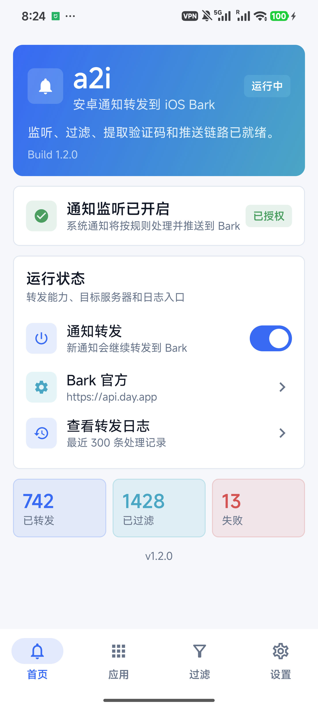

# GotMsg · 有消息

把安卓手机上的系统通知（短信、验证码、来电、微信、QQ、Telegram、企业微信、App 推送等）实时转发到 **iPhone、iPad、其它安卓机、鸿蒙机、桌面邮箱**，并在接收端直接**远程回复**原安卓手机。

适用于把安卓备机的消息同步到主力机，不漏验证码、不漏重要聊天、不断网仍能收到关键通知。


---

## 一、五分钟上手

### 1. 安装
从 [Releases](../../releases) 下载最新 APK，安装到**需要被转发的安卓手机**（需 Android 14 / API 34+）。Release 同时提供 universal 全架构包和 arm64-v8a / armeabi-v7a / x86 / x86_64 单架构包，App 内更新页会默认选中与你设备最匹配的版本。

### 2. 选一个推送通道
推荐三选一：

| 接收设备 | 推荐通道 | 难度 |
|---|---|---|
| iPhone / iPad | **Bark** | ⭐ 最简单 |
| 安卓手机 | **ntfy** | ⭐ 推荐开源 |
| 鸿蒙手机 | **Meow** | 鸿蒙专属 |
| 任何能收邮件的设备 | **电邮** | 桌面/平板可用 |

打开 GotMsg -> 「设置」-> 选对应通道 -> 点右上角 **i** 按钮 -> 按弹窗步骤配 -> 点该行「发送」测试。可以**同时启用多个通道**，所有勾选的会并行收到。

### 3. 授权通知监听
首页会提示「需要授权通知监听」。点击「前往系统授权」，在系统的通知访问设置中开启 GotMsg。

### 4. 开启转发
首页打开「通知转发」开关。安卓收到通知后按配置自动推送到各通道。**发现新版时也会自动把更新通知推给所有已启用的通道**，不用进 App 也能升级。

---

## 二、推送通道配置详解

每条配置都可独立勾选/删除/排序/测试。点「添加」时建议每条都先「发送」测试一次。

### 2.1 Bark（iOS / iPadOS）

[Bark](https://github.com/Finb/Bark) 是 iOS 上最轻量的推送方案，复制地址即用，**推荐所有 iOS 用户首选**。

**配置步骤**：
1. iPhone / iPad 上安装 Bark，首次打开允许通知权限。
2. 复制 Bark 首页的推送地址，形如 `https://api.day.app/你的Key`。
3. GotMsg「设置 -> Bark 服务器 -> 添加」：
   - **名称**：随意，例如「我的 iPhone」
   - **服务器地址**：`https://api.day.app`（自建则填自建地址）
   - **Device Key**：Bark 地址中 `/` 后面的那段
4. 保存后点「发送」测试；iPhone 收到「GotMsg 测试」即成功。
5. 多台 iOS 设备：可继续添加多条 Bark 配置，每条独立勾选；列表顺序即推送顺序，可开启「首个成功即止」或全部广播。

**为什么推荐 Bark**：iOS 上点击 Bark 通知体验最自然；通知附带 GotMsg 回复链接，可从 iPhone 直接回复原安卓；Bark 服务器在中国大陆可直接访问。

### 2.2 ntfy（Android / iOS / 网页）

[ntfy](https://ntfy.sh) 是开源的 HTTP pub-sub 通知服务，**支持 Android、iOS 和网页端**，无需注册项目。

**配置步骤**：
1. 接收端安装 ntfy：
   - Android：[Google Play](https://play.google.com/store/apps/details?id=io.heckel.ntfy) / [F-Droid](https://f-droid.org/en/packages/io.heckel.ntfy/) / [GitHub](https://github.com/binwiederhier/ntfy)
   - iOS：[App Store](https://apps.apple.com/us/app/ntfy/id1625396347)
2. 打开 ntfy -> 添加订阅。服务器填 `https://ntfy.sh`（或自建地址）；Topic 用一串**随机难猜的名字**（如 `gotmsg_a8f3d2`）。
3. GotMsg「设置 -> ntfy 转发 -> 添加」：
   - **服务器**：与接收端完全一致
   - **Topic**：与接收端完全一致
   - **Token**：仅自建服务且启用了鉴权时填
4. 保存后点「发送」测试；接收端收到「GotMsg 测试」即成功。

> **安全提示**：公共 topic 谁知道名字就能订阅或发送。Topic 名**不要用**手机号、姓名、邮箱等可猜信息。
>
> **远程回复**：GotMsg 在转发聊天类通知时，会**自动给 ntfy 通知挂上「View」动作按钮和正文中的回复链接**。iOS 上点通知本体只能进 ntfy App，要回复请点动作按钮或正文里的回复链接。

### 2.3 Meow（鸿蒙 / HarmonyOS）

Meow 是鸿蒙手机的推送接收方案。GotMsg 按你填写的 Meow 接口地址和 Device Key 发出 HTTP 请求即可。

**配置步骤**：
1. 鸿蒙手机上安装 Meow，确认 Meow 自身能正常接收推送。
2. 在 Meow 里找到**推送接口地址**和对应的 **Device Key / Token**。
3. GotMsg「设置 -> Meow 转发 -> 添加」：
   - **名称**：按鸿蒙设备填写（方便区分多台）
   - **服务器地址**：Meow 给出的完整 API 地址
   - **Device Key**：Meow 给你的设备 Key（**不是**鸿蒙锁屏密码、华为账号密码）
4. 保存后点「发送」测试；鸿蒙手机收到「GotMsg 测试」即成功。

> 失败排查：检查 Meow 接口地址是否完整、Key 是否复制完整、鸿蒙手机是否允许 Meow 通知。

### 2.4 电邮转发

通过 SMTP 把通知发到邮箱（**适合无手机接收的场景**，如仅在桌面/平板查看）。GotMsg **直连 SMTP**，不依赖外部邮件服务。

**配置步骤**：
1. 准备一个 SMTP 邮箱（QQ/163/Gmail/Outlook 都可），**开启 SMTP 服务并生成授权码**（不是登录密码）。
   - QQ：设置 -> 账户 -> POP3/IMAP/SMTP/Exchange/CardDAV/CalDAV服务 -> 开启 SMTP -> 生成授权码
   - 163：设置 -> POP3/SMTP/IMAP -> 开启 SMTP -> 设置授权码
   - Gmail：账户 -> 安全性 -> 两步验证 -> 应用专用密码
2. GotMsg「设置 -> 电邮转发 -> 添加」：
   - **服务器（SMTP 主机）**：`smtp.qq.com` / `smtp.163.com` / `smtp.gmail.com` 等
   - **端口**：`465`（推荐，隐式 SSL）
   - **账号**：完整邮箱地址
   - **授权码 / 密码**：上一步生成的授权码
   - **发件人**：通常与账号相同
   - **收件人**：接收通知的目标邮箱
3. 保存后点「发送」测试；收件人收到「GotMsg 测试」即成功。

> **国内邮箱推荐端口 465**（QQ/163 均支持）。Gmail 需要应用专用密码而不是账户密码。

### 2.5 断网短信兜底

**当安卓手机没有网络时**，把重要通知（验证码、来电）通过 **SIM 卡短信** 发到另一台手机（通常是你的 iPhone）。需要安卓卡里还有短信套餐余量。

**配置步骤**：
1. 在 GotMsg「设置 -> 短信兜底」点「授予短信权限」（安卓系统权限）。
2. 点「添加」输入**目标手机号**（如 iPhone 号，接收端是另一台手机，**不是** GotMsg 本身）。
3. 选运营商：
   - 选了「自动识别」：GotMsg 会发免费查询短信给运营商服务号，解析回执获取余量。回执短信本身会被识别并拦截，不转发。
   - 选了「手动额度」：在「手动短信额度」填入当前套餐短信条数，每次发短信后自动减 1。
4. 当余量 ≤ 5 时自动暂停，下次打开 App 提醒续费。
5. 频率限制：每 5 分钟最多发 1 条（避免刷屏），同一条通知 5 分钟内不重复。

> **适用场景**：安卓手机没 WiFi 时，验证码不会丢，漏不了重要登录。

---

## 三、通知远程回复（Bark / ntfy）

GotMsg v1.11.0 起，Bark 和 ntfy 转发通知会附带回复入口，接收端在 iPhone 或 Android 上打开回复页输入内容后，回复会经 **GotMsg 中继（`https://r.gotmsg.pp.ua`）送回原 Android 手机**。GotMsg 优先使用原通知的 Android `RemoteInput` 快捷回复能力；微信等没有 `RemoteInput` 的 App 走无障碍兼容回复；微信 8.0.49+ 进一步屏蔽无障碍时，可启用 **Shizuku 路径**直接调用 `input` 命令绕过。

### 3.1 三种回复路径

| 路径 | 适用 | 是否需要解锁原手机 | 额外授权 |
|---|---|---|---|
| **原生 RemoteInput** | 短信、WhatsApp、企业 IM、Telegram 等暴露系统回复动作的 App | 否（后台执行） | 无 |
| **无障碍兼容回复** | QQ、支付宝、淘宝、钉钉 | 是 | 「GotMsg 兼容回复」无障碍服务 |
| **Shizuku 兼容回复（仅微信）** | 微信（绕过无障碍屏蔽） | 是 | Shizuku 已启动并授予 GotMsg 权限 |

### 3.2 启用方式

1. **Bark / ntfy 接收端**：无需任何额外配置。GotMsg 自动在通知正文或 ntfy 动作按钮里附上回复链接。
2. **原 Android 手机**：
   - 默认即可使用 `RemoteInput`（无需任何操作）。
   - 想在没有 `RemoteInput` 的 App 上回复，进入「设置 -> 通知回复」打开「无障碍兼容回复」，再到系统无障碍设置里启用「GotMsg 兼容回复」服务。
   - 想在最新版微信上回复，启用 **Shizuku**（在 GitHub Releases 下载并启动），GotMsg 首页会显示 Shizuku 状态卡片；点击「授权 Shizuku」即可。微信路径会自动以 Shizuku 身份模拟 `input tap` 聚焦输入框、写剪贴板、`KEYCODE_PASTE` 注入任意 Unicode，并通过截图像素扫描识别微信绿色发送按钮。

### 3.3 使用流程

- Bark：通知点击目标会优先变成回复页，正文也会附带回复链接；普通消息不会再跳微信/QQ 等原 App。
- ntfy：通知附带 View 动作按钮和正文中的回复链接；iOS 上点通知本体只进入 ntfy App，请点动作按钮或正文里的回复链接。

完整使用方法与限制见 [docs/notification-reply.md](docs/notification-reply.md)。接收端不需要安装 iOS 快捷指令，也不需要订阅额外的 `_reply` topic（旧版方案已移除，见 [docs/A2iReply-shortcut.md](docs/A2iReply-shortcut.md)）。

> 链接 10 分钟内有效，只能成功提交一次。原生快捷回复可在后台执行；无障碍 / Shizuku 兼容回复会亮屏并打开原 App；自动解锁仅对**无密码滑动锁**有效，密码 / PIN / 指纹锁需手动解锁一次；完成后会**自动重新锁屏**。付款、订单、营销等非聊天通知不能回复。

---

## 四、自建推送服务（可选）

所有通道都支持自建，更好、更私密、可控。

### 4.1 自建 Bark 服务器

GotMsg 默认用 Bark 官方服务器（`https://api.day.app`），免费够用。自建适合追求完全控制。

**Docker 一键部署**（推荐）：
```bash
docker run -d --name bark --restart=unless-stopped \
  -p 8080:8080 \
  -v /var/lib/bark:/data \
  finab/bark-server
```

然后用 Nginx Proxy Manager 加 HTTPS 域名。详细三种方案对比请看 [Bark 官方文档](https://github.com/Finb/Bark)。

**GotMsg 配置**：服务器地址填 `https://你的域名.com`（不要 `/push` 后缀），Device Key 填你在自建 Bark 上创建的 Key。

### 4.2 自建 ntfy 服务器

[ntfy](https://ntfy.sh) 是为自建设计的，**比 Bark 还简单**——官方直接提供 Docker 一行启动：

```bash
docker run -d --name ntfy --restart=unless-stopped \
  -p 80:80 \
  -v /var/lib/ntfy:/var/lib/ntfy \
  binwiederhier/ntfy serve
```

推荐加 Nginx 反代上 HTTPS 域名。完整文档：[docs.ntfy.sh](https://docs.ntfy.sh/install/)。

**GotMsg 配置**：服务器地址填 `https://ntfy.你的域名.com`，Topic 照旧。

### 4.3 自建 Meow 服务器
Meow 是鸿蒙客户端，服务端一般用 Meow 自带的。GotMsg 端无需配置服务端，只需填 Meow 给你的接口地址 + Key。

---

## 五、应用内更新

GotMsg 内置更新检测：定期拉取 Gitea + GitHub Releases，**发现新版时自动向所有已启用通道推送一条更新通知**（带当前版本号、目标版本号、变更摘要、APK 大小）。首页显示醒目横幅，可选「立即下载」或「忽略此版本」。

下载页会**默认选中匹配你设备 ABI 的 APK**（universal / arm64-v8a / armeabi-v7a / x86_64 / x86），也可手动切换架构；下载完成后通过 `FileProvider` 调起系统安装器。

Gitea 源为主（国内可达），GitHub 为兜底；主源下载失败会自动尝试另一个源的同版本链接。

> 取消自动检查：在「设置 -> 应用内更新」关闭「更新检查」即可，手动检查仍可用。

---

## 六、来电与未接来电

MIUI / HyperOS 不向第三方监听器分发系统电话通知。GotMsg 通过 **轮询 `TelephonyManager.getCallState()`** 绕过此限制：

- **来电**：构造「有电话进来」推送（Android 14+ 禁止第三方读取实时号码）；如无障碍服务读到号码则展示真实号码。
- **未接来电**：通话结束后查系统 `CallLog` 获取号码，并通过 `ContactsContract.PhoneLookup` 反查**联系人姓名**，推送形如「张三\n138xxxx」。

需要在系统设置中授予「电话」权限（设置 -> 应用 -> GotMsg -> 权限 -> 电话）。

---

## 七、过滤与噪音控制

通知处理流水线（在 `NotificationProcessor` 中按顺序执行）：

1. 全局开关
2. 持续性通知（ongoing）静默
3. VPN / 代理客户端（Surfboard、Clash Meta、Clash for Android、v2rayNG、小米设备互联）常驻通知静默
4. 米家「设备状态」泛化通知静默（门锁 / 告警等具体事件仍正常转发）
5. App 黑/白名单
6. 空内容 / 脱敏内容
7. 噪音包名（三星剪贴板 / 键盘、GMS、SystemUI、Google 输入法）
8. 系统状态消息（"正在运行"等）
9. **泛化无意义通知**（标题「新消息」+ 正文「你有一条新消息」等占位文案）静默
10. 近空内容（纯符号 / 纯空格 / 仅 App 名）
11. 广告过滤（内置营销关键词 + 用户自定义关键词）
12. 已发短信（仅收不发）
13. 运营商余额回执拦截（解析余量后不转发）
14. 去重检查（5 秒窗口）
15. 验证码提取（关键词 + 数字 / 数字 + 关键词 / 纯数字 4–8 位）
16. 特殊 App 解析（微信 / QQ / Telegram 优化 + 重要消息关键词标记）
17. 构造 BarkMessage 并推送

验证码开启自动复制后会被复制到剪贴板；推送级别在重要消息上自动提升到 `timeSensitive` 以点亮 iOS 焦点通知。

---

## 八、使用建议

- **只想收验证码**：进入「过滤」页，开启「验证码自动提取」和「广告过滤」；再到「应用」页切到白名单模式，只勾选短信类 App。
- **想同步聊天**：保持黑名单模式（默认），在「过滤」页开启「微信 / QQ / Telegram 优化」。
- **通知没推过来**：先看「日志」页，每条通知（无论转发、过滤还是失败）都会记录原因。失败会自动加入 pending 队列，由 WorkManager 每 15 分钟重发。
- **想让通知带图标**：见下方「应用图标」一节。
- **电话通知不工作**：MIUI 不向第三方监听器分发系统电话通知，GotMsg 通过轮询 `getCallState()` 绕过此限制。需授予「电话」权限。
- **断网收不到通知**：开启「设置 -> 短信兜底」并填好 iPhone 号码、授予短信权限。断网时验证码和来电走短信（消耗套餐额度，5 分钟限 1 条）。
- **想全平台通知**：可同时启用多个通道（每个通道的多个条目独立勾选），所有启用的会同时收到。
- **推送报 connection closed**：通常不是被墙，而是手机上的代理 / VPN 客户端干扰 Bark 服务器连接；先关代理或换自建 Bark 验证。

---

## 九、应用图标

Bark 和 ntfy 的通知 `icon` 字段需要公网可访问的图片 URL。GotMsg 支持把已安装 App 的图标批量导出，方便上传到你自己的图床。

规则：转发时 `icon = 图标 URL 前缀 + 安卓包名 + .png`。在「设置 -> 应用图标」里：

1. 填写图标 URL 前缀，例如 `https://你的图床域名/icons/`。
2. 选择一个目录，点「导出图标」，把该目录下所有 App 的图标以 `包名.png` 形式导出。
3. 把导出的图片上传到你的图床对应目录。

留空前缀则不显示图标。

---

## 十、构建与体积

Release 构建开启 **R8 + 资源压缩**，universal APK 约 5 MB；同时输出 ABI splits，每个架构单独的 APK 体积更小。

构建：
```bash
export JAVA_HOME="D:/Dev/JDK-17" ANDROID_HOME="D:/Dev/Android/SDK"
./gradlew assembleRelease
# 产物：app/build/outputs/apk/release/app-universal-release.apk
#       app/build/outputs/apk/release/app-arm64-v8a-release.apk
#       app/build/outputs/apk/release/app-armeabi-v7a-release.apk
#       app/build/outputs/apk/release/app-x86-release.apk
#       app/build/outputs/apk/release/app-x86_64-release.apk
```

`release` 复用 `debug` 签名配置（`signingConfigs.getByName("debug")`），适合个人发布到 GitHub / Gitea Release；正式商店上架前需替换为独立的 release keystore。

---

## 十一、界面截图

| 首页 | 应用管理 | 过滤设置 |
|---|---|---|
|  |  |  |

| 设置 | 转发日志 |
|---|---|
|  |  |

---

## 十二、隐私与安全

- GotMsg **不收集任何遥测**到第三方；本地仅记录最少必要的设备 ID / 密钥（用于回复中继鉴权，256 位随机，备份规则明确排除）。
- 回复中继 `https://r.gotmsg.pp.ua` 只持久化**设备密钥 + 回复令牌的 SHA-256 哈希**，正文 24 小时后清除；回复链接放在 URL fragment 中，不会进入服务器访问日志。
- 拿到回复链接的人可在 10 分钟有效期内提交一次回复，因此不要转发或公开该链接。
- 无障碍 / Shizuku 兼容回复仅在收到有效的一次性回复事件时运行，严格校验目标包名；Shizuku 路径只点击经像素扫描确认的微信绿色发送按钮，避免误操作。

---

## License

本项目仅供个人使用。自 v1.10.2 起闭源。

All Rights Reserved. 保留所有权利。